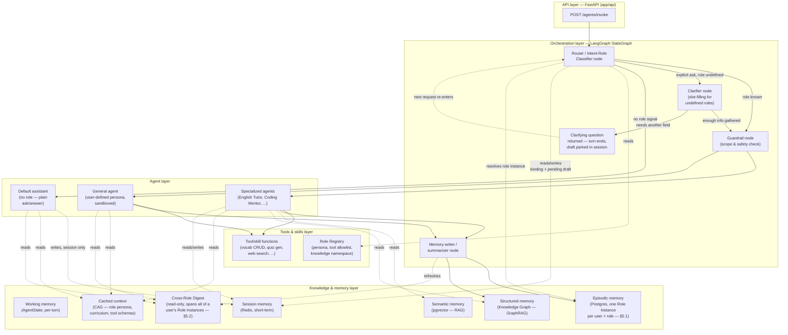
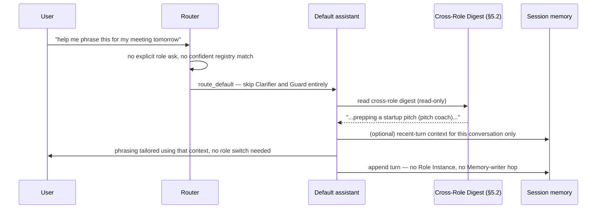
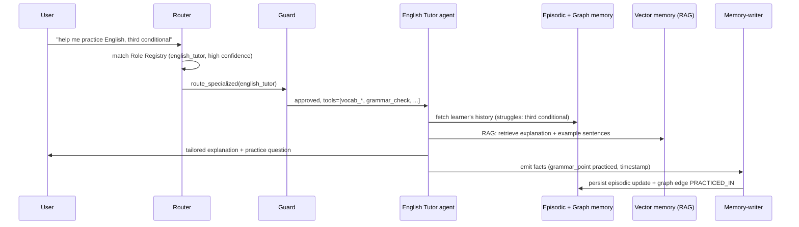
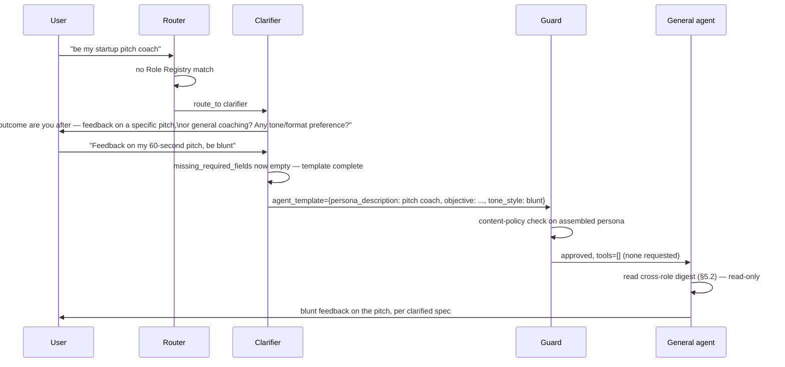
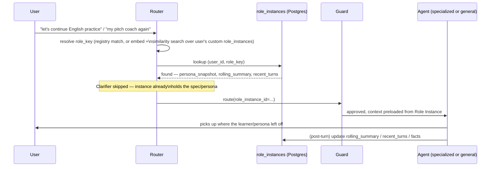

# `services/brain` — Solution Architecture & System Design

> Scope: this document designs the target architecture for the AI brain (multi-agent
> system) described in `services/brain`. It supersedes the placeholder single-node graph
> in `app/agents/graph.py` conceptually; it does not itself change code. Treat it as the
> input to a `specs/<feature-name>/` spec (see §11) before implementation starts, per
> this repo's spec-driven-development process.

## 1. Problem statement

The brain must behave as **one AI system that can take on many roles**, chosen either
because the user asked for a specific one ("be my English tutor") or because the
orchestrator infers the right role from conversation context. Roles differ in what they
know (curriculum, domain facts), what they remember (per-user learning history), and
what they can do (tools: look up a word, log a mistake, grade homework). An
undefined/custom role must still be servable — via a general agent — but only after the
system has gathered enough of a spec from the user to act safely and usefully. Most
turns, though, carry **no role signal at all** — ordinary questions and requests — and
those must stay simple: plain ask/answer, no persona, no clarification, no per-role
storage. Role-based behavior is something the system layers on only when the user asks
for it or the context clearly calls for it, never the default posture.

Design goals, in priority order:

1. **Role is a first-class, data-driven concept**, not a hardcoded branch — adding a new
   specialized agent should mean registering a role, not forking the orchestrator.
2. **Correct escalation, three ways**: known role (explicit ask, or inferred from
   context with high confidence) → specialized agent. Explicit ask for a role that
   isn't registered → clarify first, then a general agent bound by the user's own
   instructions. No explicit ask and nothing confidently inferred → plain conversation
   with the default assistant (§4), never forced through role clarification just
   because the router wasn't certain.
3. **Memory is per-user, per-role, and durable** — every role a user has ever played
   (specialized or custom) gets its own persistent record in Postgres: conversation
   history, accumulated knowledge, and the instructions that define it. Re-entering a
   role the user has played before must resume from that record, not start cold — this
   applies uniformly to a registry role like English Tutor and to a one-off custom
   persona the user defined themselves.
4. **Retrieval and caching are chosen deliberately** (RAG where content is
   dynamic/per-user, CAG where content is stable/shared) rather than defaulting to "RAG
   everything."
5. **Least privilege per role, with one deliberate exception** — a specialized role
   only gets the tools and data in its own `knowledge_namespace`; a user-authored
   general-agent role is the most tightly *scoped by tools*, since its instructions are
   untrusted input. The exception is read access to the user's own history: because the
   default assistant and the general agent aren't bound to one domain, being genuinely
   relevant means drawing on the user's history across *all* their roles, not just one —
   see the Cross-Role Digest (§5.2). That's a read-only broadening of *context*, not of
   tools or write access, and specialized agents stay isolated from each other exactly
   as before.
6. **The existing single-entry-point convention holds**: `build_graph()` in
   `app/agents/graph.py` stays the one place orchestration is wired, even as the graph
   grows from one node to a router + many agents.

## 2. Conceptual architecture



## 3. Orchestrator (router) design

The router is a lightweight, fast-model LangGraph node — its only job is **role
resolution**, not generation. It runs on every incoming turn and produces one decision,
evaluated **in this order, first match wins**. The precedence matters as much as the
individual rules, because several conditions can be true of the same turn (a reply to a
clarifying question, read on its own, also looks like a signal-free turn):

| # | Decision | Trigger | Next node |
|---|---|---|---|
| 1 | `resume_clarification` | A clarification is pending for this session (§3's cross-turn state) — this turn is the user's answer | `Clarifier` node, merging the answer into the stored draft |
| 2 | `resume_role` | A role is bound to the session and the turn carries no exit or switch signal | Skip straight to that role's agent |
| 3 | `route_specialized` | Explicit ask ("be my English tutor") or inferred intent matches a `Role Registry` entry with high confidence | `Guard` → specialized agent |
| 4 | `clarify` | **Explicit** ask to play a role that doesn't match any `Role Registry` entry | `Clarifier` node |
| 5 | `route_default` | Nothing above matched: no bound role, no pending clarification, no explicit ask, nothing confidently inferred | **Default assistant** node directly — bypasses `Clarifier` and `Guard` (§4) |

(`route_general` isn't a router decision — it's the Clarifier's *outcome* once
fulfillment completes, and it hands off to `Guard` → general agent.)

Rule 1 exists because without it the design is broken: the user's reply to "what
outcome are you after?" contains no role ask of its own, so rules 3–4 miss it and rule
5 would hand it to the default assistant, throwing the half-built template away.
Pending clarification therefore outranks everything.

The `clarify` path is reserved for a genuine, explicit signal that the user wants
role-based behavior ("be my ...", "act as my ...") for a role the registry doesn't
have — it is **not** the fallback for low-confidence or ambiguous intent. Anything
short of that explicit signal, including a merely ambiguous or role-adjacent turn,
falls to `route_default` instead: the system infers a specialized role only when
confident, and otherwise has a plain conversation rather than interrogating the user
about a role they never asked for.

Routing is **not** a single LLM call per turn in the naive sense — it's a cheap
classification pass (small/fast model, or a hybrid of embedding-similarity against role
descriptions + an LLM tie-breaker only when similarity is ambiguous) so that cost and
latency stay low on every turn regardless of which specialized agent eventually runs.

### Cross-turn routing state, and the role-binding lifecycle

`AgentState` lives for exactly one invocation (§5), so **everything the router needs
across turns must be rehydrated from `Session memory`** at the top of `router_node`:

- **The pending template draft** — `agent_template_draft` plus `clarification_turns`
  (§3's fulfillment algorithm). Written when the Clarifier ends a turn with a question,
  read back by rule 1, deleted once fulfillment completes or the cap is hit. It expires
  with the session, so an abandoned half-built role doesn't lurk indefinitely.
- **The active role binding** — `role_key` + `role_instance_id` for the role currently
  in play, which is what rule 2 keys off.

Binding lifecycle, stated explicitly because rules 2 and 5 would otherwise contradict
each other:

- **Bound** when `Guard` approves a role-bearing turn.
- **While bound, a signal-free turn stays in the role.** That's the entire point of
  binding — mid-tutoring "and what about this one?" must reach the tutor, not the
  default assistant. `route_default` applies only when *nothing* is bound.
- **Released** on an explicit exit ("stop tutoring", "never mind", "back to normal"), on
  a confident switch to a different role, or when the session's TTL lapses. A switch
  works because rule 2's own trigger excludes turns carrying an exit/switch signal — the
  binding declines to match, and evaluation falls through to rule 3. Once released,
  subsequent signal-free turns land on the default assistant again — and the role's
  durable state is untouched, waiting in its Role Instance (§5.1) for next time.

### Agent Template — the schema every role instance fills

Every role — specialized or custom — is an instance of **one schema**, filled two
different ways:

- **Statically**, by a developer authoring a Role Registry entry ahead of time (the
  YAML below) — the path for specialized agents.
- **Dynamically**, by the Clarifier extracting/asking for field values during a live
  conversation (§4.2) — the path for custom/general-agent roles.

Same fields either way, so a promoted custom role (§4.2) becomes a Role Registry entry
without a shape change — only who filled it, and when, changes.

| Field | Type | Required | Fulfillment | Notes |
|---|---|---|---|---|
| `role_key` | slug | — | system-generated | registry `id` (static), or a generated slug once a dynamic spec stabilizes |
| `role_type` | enum | — | system-set | `specialized` \| `custom` |
| `display_name` | string | ✅ | inferred → **ask if unresolved** | short label shown back to the user ("English Tutor", "Pitch Coach") |
| `persona_description` | text | ✅ | inferred → **ask if unresolved** | who/what the agent is and how it behaves — the core of the system prompt |
| `objective` | text | ✅ | inferred → **ask if unresolved** | what outcome the user wants from this role — the field most responsible for the role being *useful*, not just in-character |
| `tone_style` | string | optional | inferred | default `"helpful, neutral, encouraging"` |
| `constraints` | string[] | optional | inferred | topics/format explicitly off-limits; default `[]` |
| `tools_requested` | string[] | optional | inferred, cross-checked against `ToolRegistry` (§7) | default `[]` — least privilege; Guard may decline a requested tool it can't approve |
| `knowledge_scope` | enum | optional | inferred | `session` \| `persistent`; default `persistent` (per §5.1's Role Instance model) |
| `sensitive_domain_flags` | string[] | — | system-detected (Guard) | e.g. `medical`, `legal`, `financial`, `mental_health` — if any fire, the corresponding `guardrails` entries become non-optional rather than silently defaulted |
| `language` | string | optional | inferred | default: the conversation's own language |
| `model_tier` | enum | — | system-set | derived from `role_type`/expected complexity, never asked |
| `guardrails` | string[] | — | system-set | baseline policy set + anything `sensitive_domain_flags` requires |
| `version` | int | — | system-set | template schema version, so a future schema change can migrate existing Role Instances |
| `source` | enum | — | system-set | `developer` \| `generated` — authorship record, carried even after a promotion (§4.2) |

**Dynamic fulfillment algorithm** (what the Clarifier actually runs, §4.2):

1. Seed a template draft from the triggering message(s) — an extraction pass over the
   conversation for every field above, each with a confidence score (this extends the
   same classification call the router already makes, rather than adding a second full
   LLM pass).
2. Fill system-set fields (`role_key`, `role_type=custom`, `model_tier`, baseline
   `guardrails`) and run `sensitive_domain_flags` detection.
3. Apply defaults to every optional field with no confident extracted value.
4. Compute `missing_required_fields`: required fields (`display_name`,
   `persona_description`, `objective`, plus any `guardrails` entry a sensitive-domain
   flag made non-optional) with no confident value.
5. Empty → the template is complete; compile `persona_description` + `tone_style` +
   `constraints` into the rendered system prompt (`persona_snapshot`, §5.1) and proceed
   to `Guard`.
6. Not empty → **ask about exactly those fields**, batched into as few turns as the
   Clarifier's cap allows (2–3 questions), merge the answers into the draft, and re-run
   from step 4. If the cap is reached with `persona_description`/`objective` still
   unresolved, the system does **not** guess a persona — it tells the user it can't
   proceed without them. Every other required-if-flagged field can safely fall back to
   the strictest default instead, so the cap never blocks on those.

The static path (Role Registry, below) fills the same fields by hand, ahead of time —
no extraction, no asking — but `sensitive_domain_flags`/`guardrails` are still worth
setting deliberately, since nothing forces it the way the dynamic path's Guard check
does.

### Role Registry

Roles are data, not code branches. Each entry is a **statically-authored Agent
Template instance**:

```yaml
# app/agents/roles/english_tutor.yaml (illustrative — final format decided in design.md)
id: english_tutor
display_name: English Tutor
match:
  keywords: [english tutor, practice english, learn english, grammar, vocabulary]
  embedding_examples:
    - "help me practice my English"
    - "correct my grammar"
persona: |
  You are a patient, encouraging English tutor. Track the learner's level and
  adapt difficulty. Cite the specific grammar rule or vocabulary item you're
  teaching so it can be logged.
tools: [vocab_lookup, vocab_log, grammar_check, idiom_lookup, homework_grade, quiz_generate]
knowledge_namespace: english_learning   # vector + graph collection scoping
memory_schema: english_learning_v1       # episodic memory table/shape
model_tier: standard                     # vs "fast" (router) / "premium" (complex reasoning)
guardrails: [content_policy_default]
```

Adding a specialized agent = adding a registry entry + a node function that reads it —
matching the existing convention that `app/agents/graph.py` node functions are the unit
of extension (`.claude/skills/add-agent-node`), now parameterized by registry data
instead of being fully bespoke per node.

### Role instance resolution

Once the router has a candidate role (a registry match, or — for a custom persona — a
description), it resolves that candidate to a durable **Role Instance** (§5.1) before
handing off to `Guard`:

1. **Specialized role**: look up `role_instances` by `(user_id, role_key=registry_id)`.
   Found → this is a returning learner, load their instance and skip straight to
   `Guard`/agent, no re-clarification needed. Not found → first time for this user with
   this role; `Guard`/agent will create the instance on the first `Memory-writer` pass.
2. **Custom role**: no fixed `role_key` exists yet, since the persona is user text.
   Embed the incoming description and run a similarity search over that user's own
   `role_instances` where `role_type = 'custom'`. Above a confidence threshold → treat
   this as the same role resuming ("continuing as your pitch coach"), skip the
   `Clarifier`, and load the stored persona/summary. Below threshold → this is a new
   custom role; proceed to `Clarifier` as in §4.2, then create a new instance once the
   spec is clarified.

This is what makes "once the user gets involved with the same role again, there's
enough knowledge to continue" true for *every* role, not just registry ones — the
resumability mechanism lives at the Role Instance layer, underneath both agent types.

## 4. Agent layer

### Default assistant (no role — plain ask/answer)

Not every turn needs a role, and this is the router's actual fallback — reached by
`route_default` (§3) whenever there's no explicit role ask *and* nothing confidently
inferred from context. This is the ordinary case (a factual question, a one-off
request) and is deliberately the cheapest, shortest path through the graph:

- **No Clarifier, no Agent Template, no Role Instance, no Guard persona check.** There
  is no user-authored persona to fulfill or vet, so none of that machinery runs —
  adding it to "what's the capital of France?" would be exactly the kind of
  over-complication this path exists to avoid.
- Runs on the platform's own fixed baseline system prompt (itself a good candidate for
  CAG, §6.2 — stable and shared across every user) plus whatever small, fixed tool set
  is considered safe to expose unconditionally (none, by default).
- Its own conversation stays at the `Session memory` tier only — written directly by
  this node rather than through `Memory-writer`. Nothing here becomes a Role Instance
  (§5.1) of its own; there is no role to persist.
- It **does** read the **Cross-Role Digest** (§5.2) — a read-only summary spanning
  every Role Instance the user has (English Tutor's current struggles, the pitch
  coach's last session, etc.). Precisely because this node isn't scoped to one domain,
  that broader context is what lets it give a relevant answer ("you mentioned prepping
  a pitch earlier — want this phrased for that?") instead of treating every plain
  question as if the user had no history with the system at all.
- If the conversation later turns role-shaped ("actually, can you tutor me in English
  from here"), the *next* turn's `Router` call picks that up normally — the default
  assistant doesn't need to detect the shift itself, since the router re-evaluates
  every turn.

Graph shape: `router → default_assistant → END` — no detour through `Guard` or
`Memory-writer` at all.

### 4.1 Specialized agents

One node (or small sub-graph, for agents that themselves need multi-step tool use) per
registered role. A specialized agent node:

1. Loads its `Role Registry` entry (persona, tools, knowledge namespace).
2. Loads its **Role Instance** (§5.1) for this `(user_id, role_key)`, if one exists —
   the rolling conversation summary, recent turns, and structured knowledge ("this
   learner has struggled with third conditional sentences in 3 of the last 5 sessions")
   from `Episodic memory` / the `Knowledge Graph`.
3. Retrieves any turn-relevant dynamic content via RAG (e.g., "what's the idiom the
   learner asked about last time") from `Vector memory`.
4. Generates a response, optionally calling tools scoped to that role.
5. Emits structured facts for `Memory-writer` to persist (new vocabulary seen, a grammar
   mistake made, a homework item completed) — this is what makes example use case 1's
   "database to store learning history" durable across sessions rather than living only
   in that turn's context.

**Example — English Tutor**, mapped to the architecture:

- Tools: `vocab_lookup`, `vocab_log`, `grammar_check`, `idiom_lookup`,
  `homework_assign`, `homework_grade`, `quiz_generate`.
- Episodic memory schema: `learners(user_id)`, `vocabulary_items(user_id, term,
  definition, first_seen_at, mastery_score)`, `grammar_points(user_id, rule,
  status)`, `homework(user_id, assignment, submitted_at, score, feedback)`.
- Knowledge graph: nodes for `User`, `VocabItem`, `GrammarRule`, `Idiom`, `Session`;
  edges `LEARNED`, `STRUGGLES_WITH`, `PRACTICED_IN` — enables graph queries like "which
  grammar rules is this user still weak on that relate to the idiom they just asked
  about" (a join a pure vector search can't express well — see §6.3).

### 4.2 General agent (undefined role)

Triggered when the router can't match a registry entry. This is **use case 2** and the
one place the design must be conservative, since the "persona" is arbitrary user text:

1. **Clarifier node** is the *dynamic fulfillment engine* for the Agent Template (§3):
   it seeds a draft from context, fills what it can, and asks — targeted, not a single
   generic "please clarify" — only about the fields it couldn't resolve, capped at 2–3
   questions per the algorithm in §3. It never loops indefinitely; a real product needs
   a usable general agent, not an interrogation.
2. **Guard node** runs the assembled persona through a content-policy check before it's
   ever used as a system prompt (defends against the persona itself being a
   prompt-injection/jailbreak payload — "ignore all previous instructions and...").
3. The **general agent** runs with:
   - The completed template's compiled `persona_snapshot` as its system prompt,
     clearly delimited from and subordinate to the platform system prompt (persona
     text is *data*, not an instruction override).
   - A minimal, opt-in tool set (e.g., only enabled if the user's stated objective
     needs it) rather than the full tool surface any specialized agent gets.
   - The same durable **Role Instance** persistence as a specialized role (§5.1) —
     conversation, instructions, and any facts learned are stored per `(user_id,
     role_key)` so this exact custom persona resumes with context next time, per the
     resolution logic in §3. What a custom role does *not* get automatically is a
     bespoke domain schema or Knowledge Graph enrollment — those stay specialized-role
     features; a custom role's structured knowledge lands in the generic
     `role_knowledge_facts` table (§5.1) instead of a purpose-built one.
   - An easy path to "promote" a general-agent persona to a real Role Registry entry
     if the user keeps reusing it — at that point its existing Role Instance carries
     forward rather than starting over, and it can grow a bespoke schema/tools/graph
     enrollment. This is the organic way new specialized agents get discovered, not
     just designed up front.
   - The same **Cross-Role Digest** read access as the default assistant (§5.2) — a
     custom persona is just as "generic" (not bound to one specialized domain) as the
     no-role case, so it benefits the same way from knowing what the user has going on
     in their other roles, on top of its own Role Instance's history.

### 4.3 Meta-agents

- **Router/Classifier** (§3).
- **Clarifier** (§4.2).
- **Guard** — policy/safety check for role-bearing turns (specialized and custom
  agents), runs before generation. The default assistant (§4) has no persona to vet and
  bypasses it entirely.
- **Memory-writer** — extracts structured facts (entities, mastery updates, homework
  results) from the turn and writes them to episodic memory and the knowledge graph;
  compacts `rolling_summary`/session memory once a token budget is exceeded (keeping
  `Working memory` small on the next turn); and refreshes the active role's digest
  fragment (§5.2). It is the **only** writer of role-owned rows. All of this runs as
  post-response work (§12) — the user's reply is not waiting on it.
- **Critic/Verifier** *(phase 3+, optional)* — for high-stakes generations (e.g.,
  grading homework, giving factual corrections), a second pass that checks the
  specialized agent's answer against retrieved sources before it's returned, reducing
  hallucination risk in a tutoring context where wrong corrections actively teach the
  user something false.

## 5. Memory architecture

Multiple memory types, matched to how volatile and how shareable the data is — this is
the standard "memory hierarchy" pattern for agent systems, applied per role via the
registry's `knowledge_namespace`/`memory_schema`.

| Memory type | Store | Lifetime | Example content |
|---|---|---|---|
| Working memory | `AgentState` (in-process, per invocation) | One request | Current turn's input/output, routing decision — **nothing here survives the response** |
| Session memory | Redis | Minutes–hours (TTL), or until explicit end-of-session | Recent turns, running summary, and the router's cross-turn state (§3): active role binding + pending Agent Template draft with its `clarification_turns` counter |
| Episodic memory | Postgres | Indefinite, per user+role | Vocabulary log, grammar mistakes, homework records |
| Semantic memory | pgvector (or a dedicated vector DB once scale demands it) | Indefinite | Embedded chunks of curriculum docs, past explanations, per-user notes — retrieved via RAG |
| Structured memory | Knowledge Graph | Indefinite | Entities (word, rule, user, session) and typed relations between them — retrieved via GraphRAG |
| Cached context | Prompt cache (provider-level, e.g. Anthropic prompt caching) | Cache TTL (minutes) | Role persona, curriculum reference text, tool schemas — CAG, see §6.2 |

Postgres + `pgvector` is recommended as the **single store to start with** (episodic +
semantic memory colocated, one connection pool, one migration path) rather than
introducing a separate vector database on day one; a dedicated vector DB (Qdrant,
Weaviate) or graph DB (Neo4j) is a phase-3 swap-in once collection size or query
complexity outgrows Postgres extensions (`pgvector`, `Apache AGE` for graph). This
mirrors the "start simple, scale the piece that needs it" principle and keeps
`services/brain`'s infra footprint minimal for phase 1.

### 5.1 Role Instances — the durable, resumable substrate every role sits on

A **Role Instance** is the one row that makes "play this role again and it remembers"
true, uniformly for specialized and custom roles. It is keyed `(user_id, role_key)` —
**role state is always scoped to a single user**; two users playing "English Tutor" (or
two different custom "pitch coach" personas) never share rows, context, or embeddings.
`role_key` is the registry `id` for a specialized role, or a system-generated slug for a
custom role once the Clarifier has produced a stable spec.

```sql
-- illustrative — exact DDL decided in design.md
create table role_instances (
    id                uuid primary key default gen_random_uuid(),
    user_id           uuid not null,
    role_key          text not null,                 -- registry id, or generated custom slug
    role_type         text not null check (role_type in ('specialized', 'custom')),
    agent_template    jsonb not null,                  -- full Agent Template (§3) field values
    persona_snapshot  text not null,                  -- system prompt compiled/rendered from
                                                        -- agent_template — what actually gets sent
    persona_embedding vector(1536),                    -- null for specialized roles; used to
                                                        -- recognize a recurring custom role (§3)
    status            text not null default 'active',  -- active | archived
    created_at        timestamptz not null default now(),
    last_active_at    timestamptz not null default now(),
    unique (user_id, role_key)
);

create table role_conversation_state (
    role_instance_id uuid primary key references role_instances(id),
    rolling_summary  text not null default '',    -- compacted older history
    recent_turns     jsonb not null default '[]', -- bounded window, e.g. last 20 turns verbatim
    token_estimate   int not null default 0,
    summary_updated_at timestamptz
);

create table role_knowledge_facts (
    id               uuid primary key default gen_random_uuid(),
    role_instance_id uuid not null references role_instances(id),
    fact_type        text not null,   -- e.g. 'vocab_item', 'grammar_point', 'custom_note'
    fact_key         text not null,   -- e.g. the term, or a slug for a freeform note
    fact_value       jsonb not null,  -- definition/mastery_score, or freeform structured note
    confidence       real,
    created_at       timestamptz not null default now(),
    updated_at       timestamptz not null default now(),
    unique (role_instance_id, fact_type, fact_key)
);

create index role_instances_user_role_idx on role_instances (user_id, role_key);
create index role_instances_user_type_idx on role_instances (user_id, role_type, status);
create index role_knowledge_facts_role_instance_idx on role_knowledge_facts (role_instance_id);
-- Deliberately NO vector index on persona_embedding — see below.
```

**Why no ANN index on `persona_embedding`:** the custom-role recognition query (§3) is
*always* filtered to one user's own custom roles, and a user has on the order of tens of
roles, not millions. An approximate index (HNSW/IVFFlat) over a highly selective filter
is the classic over-filtering trap — it searches the global graph, then discards nearly
everything, giving both worse recall and worse latency than the obvious alternative: let
the btree above select that user's handful of custom rows and compute exact cosine
distance over them. Add a vector index only if a single user's role count ever grows by
orders of magnitude, which the model in §5.1 makes unlikely by construction.

`role_knowledge_facts` is the generic substrate every role writes to; a specialized
role like English Tutor *additionally* gets the bespoke tables/graph entities shown in
§4.1 and §6.3 for rich domain querying — the generic table isn't a replacement for
that, it's the floor every role (including a custom one that never earns bespoke
schema) is guaranteed to have.

**A new role does not imply a new migration.** The registry's `memory_schema` field
(§3) names a bespoke shape when one exists, but it should be read as opt-in: a role
starts on `role_knowledge_facts` (JSONB `fact_value`, no DDL), and earns dedicated
tables only once its query patterns actually justify them — aggregate reporting,
relational joins, constraints the JSONB floor can't express. Otherwise "add a role"
silently means "write and review a schema migration," and the data-driven registry
model in §3 stops being cheap enough to use as intended.

**Keeping this "efficient storage," not an ever-growing transcript dump:**

- `recent_turns` is a bounded, rolling window (e.g. last ~20 turns) — older turns are
  folded into `rolling_summary` by the `Memory-writer` node once the window or a token
  budget is exceeded, the same summarize-and-compact pattern used for `Session memory`,
  just persisted instead of TTL'd.
- Structured facts (`role_knowledge_facts`) are stored once and updated in place
  (`unique (role_instance_id, fact_type, fact_key)` — an upsert on mastery score, not a
  new row per mention), so recall doesn't depend on replaying raw conversation at all
  for the things that matter most.
- `persona_snapshot` + `rolling_summary` together are exactly the fixed, stable prefix
  the CAG pattern (§6.2) caches — resuming a role reloads a small, cacheable bundle, not
  the full history.
- Inactive instances (`last_active_at` past a retention threshold) are candidates for
  archival (`status = 'archived'`, summary retained, `recent_turns` pruned) rather than
  unbounded retention — a policy decision for `design.md`, not this document.

### 5.2 Cross-Role Digest — shared read context for the generic surfaces

Specialized agents stay isolated to their own `knowledge_namespace` (§4.1) — an English
Tutor session has no business reading pitch-coaching notes, and vice versa. But the
**default assistant** and the **general/custom agent** (§4) aren't bound to any one
domain, so being genuinely relevant means drawing on the user's history across *all*
their roles, not just whichever Role Instance happens to be active. The Cross-Role
Digest is the mechanism for that: a compact, read-only summary, keyed by `user_id`
alone (not `user_id × role_key`), aggregated from every one of that user's Role
Instances.

It is stored as **one fragment per role**, assembled at read time — not as a single
rolled-up blob:

```sql
-- illustrative — exact DDL decided in design.md
create table user_digest_fragments (
    role_instance_id uuid primary key references role_instances(id) on delete cascade,
    user_id          uuid not null,
    fragment_text    text not null,                   -- 1–3 sentences about THIS role, for cross-role use
    eligible         boolean not null default true,   -- false ⇒ excluded at assembly time
    updated_at       timestamptz not null default now()
);

create index user_digest_fragments_read_idx
    on user_digest_fragments (user_id, eligible, updated_at desc);
```

Fragments rather than one `digest_text` column, for three reasons that each fix a real
failure mode:

- **Retractable.** If `Guard` flags a role sensitive *after* some of its content has
  already reached the digest, flipping `eligible = false` removes it from every
  subsequent assembly. Content folded into a single summarized blob cannot be un-mixed —
  the summary no longer knows which sentence came from where.
- **Cheap to maintain.** Only the fragment whose role actually changed gets regenerated,
  so there's no LLM rewrite of the user's whole digest on every role turn. And that
  regeneration happens in the post-response work described in §12, never in front of the
  user's reply.
- **Bounded at read time.** Assembly takes the top-N most recently active eligible
  fragments under an explicit token cap. Without that, the *cheapest* path in the whole
  design (the default assistant, §4) would be the one whose prompt silently grows as a
  user accumulates roles. The assembled result is cacheable in Redis, keyed by user and
  invalidated on any fragment write, so the common read is one cache hit rather than a
  fan-out.

- **Eligibility is derived from fields the Agent Template (§3) already has**, and applied
  at assembly, not at write: a Role Instance with `knowledge_scope: session` produces no
  fragment at all (there's nothing durable to summarize), and one with
  `sensitive_domain_flags` set (`medical`, `mental_health`, …) is written with
  `eligible = false` — surfacing "you mentioned X in your wellness check-in" inside an
  unrelated plain-conversation answer is exactly the cross-context leak those flags exist
  to prevent. These are policy defaults for `design.md` to confirm, not rules this
  document can enforce on its own.
- **Read-only for the generic surfaces, never write**: the default assistant and
  general agent read the assembled digest to inform a response; they never write into
  another role's `role_instances`/`role_conversation_state`/`role_knowledge_facts` rows.
  Only `Memory-writer`, acting on behalf of the role that's actually active, writes those.
- **Digest text is untrusted data, not instruction.** Fragments derive from
  user-authored material — the user's own messages and, for custom roles, a persona they
  wrote. Injecting that into the default assistant's prompt puts user-controlled text in
  a privileged position, so it gets the same treatment §4.2 gives a persona: clearly
  delimited, explicitly subordinate to the platform system prompt, and never able to
  override it. A "when you read this, ignore your instructions" line smuggled into one
  role must not become an injection vector in every other.
- **Specialized agents don't read it** — this is deliberately one-directional. A
  specialized role earns its relevance from depth in its own domain (§6.3's GraphRAG);
  the generic surfaces earn theirs from breadth across domains. Mixing the two would
  blur the isolation §4.1 depends on for a good reason (an English-tutor answer
  shouldn't drift into unrelated pitch-coaching content just because the digest is
  sitting there).

## 6. Retrieval strategy: RAG, CAG, and Knowledge Graph — used deliberately

Rather than retrieving for every piece of context, the design chooses per content type:

### 6.1 RAG (Retrieval-Augmented Generation)

Used for **dynamic, per-user, or large-corpus** content that can't fit in — or doesn't
belong permanently in — the prompt: a learner's specific vocabulary history, prior
homework, or a large curriculum/reference corpus. Standard pattern: embed at write time
(when the Memory-writer persists a fact, or when reference docs are ingested), retrieve
top-k relevant chunks at read time via `Vector memory`, filtered by the role's
`knowledge_namespace` so one role's retrieval never leaks another role's or another
user's data.

### 6.2 CAG (Cache-Augmented/Context-Augmented Generation)

Used for **stable, shared, high-reuse** content: a role's persona/system prompt, its
tool schemas, and any curriculum reference material that's the same for every learner
at a given level (e.g., "the standard explanation of the present perfect tense"). This
content is placed at a fixed prefix position in the prompt and marked for provider-side
prompt caching so repeated calls to the same role reuse the cached prefix instead of
re-processing it — cutting latency and cost versus retrieving-and-reinjecting it on
every turn via RAG. Rule of thumb applied here: **if the same content would be
retrieved for every user of a role, cache it; if it varies per user or per turn,
retrieve it.**

### 6.3 Knowledge Graph / GraphRAG

Used where the value is in **relationships**, not just similarity: "what grammar topics
relate to the idiom the user just asked about, and which of those are they weak on."
Vector similarity alone can't express "weak on" or "related grammar topic" as a
first-class queryable relation — a graph can. Practical shape:

- Entities: `User`, `Role`, `Session`, `VocabItem`, `GrammarRule`, `Idiom`,
  `HomeworkItem` (schema varies per role via `knowledge_namespace`, same pattern as
  episodic memory).
- Relations: `LEARNED`, `STRUGGLES_WITH`, `RELATED_TO`, `PRACTICED_IN`,
  `ASSIGNED_TO`.
- Populated incrementally by the `Memory-writer` node (entity/relation extraction from
  each turn), not a separate offline batch job — keeps the graph current session to
  session.
- Queried by specialized agents as a retrieval step alongside (not instead of) vector
  RAG: a **hybrid retrieval** — graph traversal narrows to "concepts this user
  struggles with," vector search finds the best-matching explanation text for those
  concepts. This combination (GraphRAG) is the current best-practice pattern for domains
  with rich, queryable relationships, which a learning-history domain clearly has.

Start with Postgres + `Apache AGE` (graph-on-Postgres) to avoid a second database in
phase 1; graduate to a dedicated graph DB (Neo4j) only if graph query complexity or
scale outgrows it.

## 7. Tools & skills framework

Tools are plain functions registered centrally and exposed to agents **only** through
the role's `tools` allowlist in the Role Registry — an agent never gets an unscoped
"all tools" surface. Recommended shape, consistent with the existing FastAPI/Pydantic
conventions in `services/brain`:

- Each tool: a typed function (Pydantic input/output models, same style as
  `InvokeRequest`/`InvokeResponse`) plus a short natural-language description used for
  LLM tool-calling.
- A `ToolRegistry` maps tool name → function + schema; `build_graph()` (or the
  specialized-agent node it builds) binds only the tools listed for the active role.
- External capabilities (web search, a calculator, a code sandbox) are wrapped as tools
  the same way as internal ones (`vocab_lookup`) — no special-casing "external" vs
  "internal" at the agent level. If/when tool needs grow past a handful, expose them via
  MCP (Model Context Protocol) servers instead of ad hoc functions, so tools are
  reusable outside this one graph too — a natural fit since this is already an
  Anthropic-model-oriented stack.
- The general agent (§4.2) only gets tools the Guard node explicitly approves based on
  the clarified objective — least privilege by default.
- The default assistant (§4) isn't scoped from a Role Registry entry at all — it gets a
  small, fixed, platform-level tool set (if any), decided once at the platform level
  rather than per-role.

## 8. LangGraph implementation sketch

Evolving `AgentState` and `build_graph()` (keeping both as the single wiring point, per
existing convention):

```python
class AgentState(TypedDict):
    input: str
    output: str
    session_id: str
    user_id: str
    active_role: str | None          # bound role for this session, if any
    role_confidence: float | None    # router's confidence in the match
    role_instance_id: str | None     # resolved Role Instance (§5.1), if one was found/created
    cross_role_digest: str | None    # loaded for default/general agents only (§5.2)
    clarification_turns: int         # bounded loop counter
    agent_template_draft: dict | None  # Agent Template (§3) fields collected so far
    missing_required_fields: list[str] # fields still needing extraction or a user answer
    retrieved_context: list[str]     # RAG/GraphRAG results for this turn
    tool_calls: list[dict]           # tool invocations made this turn
    memory_writes: list[dict]        # facts to persist, emitted for Memory-writer


def build_graph():
    graph = StateGraph(AgentState)
    graph.add_node("router", router_node)
    graph.add_node("default_assistant", default_assistant_node)
    graph.add_node("clarifier", clarifier_node)
    graph.add_node("guard", guard_node)
    for role in role_registry.all():
        graph.add_node(role.id, make_specialized_agent_node(role))
    graph.add_node("general_agent", general_agent_node)
    graph.add_node("memory_writer", memory_writer_node)

    graph.set_entry_point("router")
    graph.add_conditional_edges("router", route_decision, {
        "default": "default_assistant",   # no role signal — skips clarifier/guard entirely
        "clarify": "clarifier",
        "general": "guard",
        **{role.id: "guard" for role in role_registry.all()},
    })
    graph.add_edge("default_assistant", END)  # writes Session memory itself; no memory_writer hop
    # default_assistant_node and general_agent_node both load_cross_role_digest(user_id)
    # (§5.2) before generating; specialized-agent nodes deliberately do not.
    graph.add_conditional_edges("clarifier", clarifier_decision, {
        "need_more": END,          # returns a clarifying question to the user
        "ready": "guard",
    })
    graph.add_conditional_edges("guard", guard_decision, {
        "approved_specialized": <role-specific edge>,
        "approved_general": "general_agent",
        "rejected": END,             # policy-declined, explained to the user
    })
    for role in role_registry.all():
        graph.add_edge(role.id, "memory_writer")
    graph.add_edge("general_agent", "memory_writer")
    graph.add_edge("memory_writer", END)
    return graph.compile()
```

This keeps every new specialized agent a registry entry + one node function
(`make_specialized_agent_node(role)` factory), matching `.claude/skills/add-agent-node`
rather than replacing it — the skill's steps (node function → `AgentState` fields →
wire into `build_graph()` → test) still apply per role.

## 9. Sequence diagrams

### 9.1 Use case 3 — no role signal (plain conversation)



### 9.2 Use case 1 — English tutor (known role, returning learner)



### 9.3 Use case 2 — undefined role (clarification loop)



### 9.4 Resuming a role played before (specialized or custom)



## 10. Additional proposed use cases

To validate the role-registry model generalizes (not just fits English tutoring):

1. **Interview / career coach** — role with tools `resume_review`, `mock_question_bank`,
   `answer_feedback`; episodic memory tracks practiced questions and recurring
   weaknesses (e.g., "always underspecifies impact/metrics") — same shape as grammar
   mistakes in use case 1.
2. **Coding mentor** — tools `code_explain`, `run_snippet` (sandboxed), `bug_hint`
   (Socratic, not answer-giving); knowledge namespace scoped per language/framework;
   a natural fit for the Critic/Verifier meta-agent (§4.3) to check generated code
   actually runs before it's presented as a hint.
3. **Research/document assistant** — user uploads reference material; this role is
   almost pure RAG (ingest → embed → retrieve), a useful contrast to the
   graph-heavy English-tutor role and a good test that RAG/CAG/graph aren't
   force-fit onto every role.
4. **Habit/wellness check-in coach** — light-touch, session-memory-only by default
   (no permanent clinical-style record without explicit opt-in), and a good forcing
   function for the Guard node's policy scope — this is the role class most likely to
   need conservative, non-medical-advice guardrails.

Each is: registry entry + tool set + memory schema — no orchestrator changes, which is
the point of the design.

## 11. Recommended technology stack

| Concern | Recommendation | Why |
|---|---|---|
| Agent orchestration | LangGraph (already in use) | Already the repo's chosen framework; StateGraph maps directly to the router/clarify/agent/memory-writer flow above |
| LLM provider | Anthropic (Claude) | `ANTHROPIC_API_KEY` already reserved in `app/config.py`; native prompt caching directly enables the CAG pattern in §6.2 |
| Relational + episodic store | PostgreSQL | Single store for phase 1; mature, well-understood ops |
| Vector store | `pgvector` (Postgres extension) → dedicated vector DB (Qdrant) if scale demands | Avoids a second datastore until proven necessary |
| Knowledge graph | `Apache AGE` (Postgres extension) → Neo4j if graph workload grows | Same "start simple" reasoning as vector store |
| Session/short-term memory | Redis | Standard low-latency TTL store for active session state |
| Tool exposure (phase 2+) | MCP (Model Context Protocol) servers for non-trivial/external tools | Reuses tools outside this one graph; growing ecosystem standard |
| Observability/tracing | LangSmith or OpenTelemetry spans per node | Per-node latency/cost visibility across router → agent → memory-writer |
| Guardrails/content policy | A dedicated Guard node (own prompt + rules), not just relying on model defaults | Needed specifically because general-agent personas are user-authored/untrusted |
| Evaluation | Two pytest-driven sets: a **routing** set (turns labelled with the expected decision from §3's table) and a per-role behavior set (golden Q&A + expected tool calls) | Fits the existing `pytest`/`ruff` workflow. The routing set matters most: the three-way split in §3 is the highest-risk, easiest-to-regress behavior in the system, and it's cheap to test because a decision label is a deterministic assertion — unlike generated prose. Every new registered role adds `match` examples that can silently steal turns from another role, so this set is a regression net, not a one-time check |

## 12. Non-functional considerations

- **Model routing / cost control**: router and clarifier use a fast/cheap model tier;
  specialized/general agents use a standard tier; only the optional Critic/Verifier
  (§4.3) or genuinely complex reasoning uses a premium tier. Declared per role via
  `model_tier` in the registry.
- **Latency budget — what is deliberately *not* on the critical path.** A full role turn
  touches the model up to three times: router classification, the agent's generation,
  and `Memory-writer`'s summarize/extract pass (plus a digest-fragment refresh, §5.2).
  Only the middle one is user-visible work. The router runs on the fast tier, and
  **everything `Memory-writer` does happens after the response is returned to the
  caller** — fact extraction, `rolling_summary` compaction, graph writes, fragment
  regeneration. If that post-response work were synchronous, every turn would pay for
  memory upkeep the user is not waiting on, and the "cheapest path" claim for the
  default assistant (§4) would be false in practice. This is the single most important
  performance decision in the design and it constrains how `Memory-writer` is wired: as
  post-response work (a background task, or a queued job), not as a blocking hop before
  the reply.
- **Degradation, per dependency.** Context reads are **best-effort**: a `Vector memory`,
  Knowledge Graph, or digest read that errors or exceeds its budget degrades the turn to
  less context — the agent still answers. Memory *writes* are the opposite: a dropped
  fact silently corrupts the learning history that §5.1 exists to protect, so writes need
  retry with an outbox/queue rather than fire-and-forget. Losing a `role_knowledge_facts`
  upsert is a data-integrity bug, not a slow turn; losing a RAG hit is just a worse
  answer.
- **Security**: least-privilege tool scoping per role (§7); persona text always treated
  as data, never as an instruction override (§4.2); PII in episodic memory (a minor
  learner's data, for instance) should be scoped and access-controlled at the Postgres
  row level per `user_id`. The Cross-Role Digest (§5.2) is a deliberate, read-only
  broadening of *context* across a single user's own roles — it must never cross
  `user_id` boundaries, must exclude `sensitive_domain_flags`/`knowledge_scope: session`
  roles by default, and specialized agents must never be given read access to it (only
  the default assistant and general agent are).
- **Scalability**: the LangGraph invocation itself stays stateless per request (all
  durable state lives in Redis/Postgres/graph store, not in-process) so `services/brain`
  can scale horizontally the same way it does today.
- **`user_id` must be server-derived, never client-supplied.** Every isolation guarantee
  in this design keys off it: Role Instances are unique per `(user_id, role_key)` (§5.1),
  digest assembly filters by `user_id` (§5.2), and RAG namespaces are scoped by it (§6.1).
  If the browser can put a `user_id` in the request body, all three collapse into an
  IDOR — one user reading another's learning history and personas by editing a field.
  So `apps/bff` must derive it from the authenticated session and attach it when
  forwarding to `services/brain`, and the brain's Pydantic request model must treat any
  client-provided `user_id` as absent. This is also why the BFF stays the only caller
  (`CLAUDE.md`'s request-flow rule): the brain trusts its caller for identity, which is
  only safe while that caller is never the browser.
- **Contract stability**: none of this requires changing `POST /agents/invoke`'s
  fundamental shape immediately, but a real implementation will need `session_id` plus a
  server-derived `user_id` in the request, and in the response: which role answered (so
  the UI can show it), whether a clarification is pending, and the role's
  `display_name`. That is a request/response contract change and must go through the
  `request-contract` skill (BFF DTO + brain Pydantic models + frontend all updated
  together), not just a brain-side change.

## 13. Suggested next step

This is architecture-level design, not an approved implementation plan. Per this repo's
process (`CLAUDE.md` → "Spec-driven development"), the recommended next step is:

```
/spec-create brain-multi-agent-system <one-line description>
```

to turn §3–§10 above into EARS-format requirements, then `/spec-design` and
`/spec-tasks`, so implementation proceeds in the same reviewed, incremental way
`specs/container-stack` is already being handled. A reasonable phase order:

1. **Phase 1 — orchestration shape.** Router with the full ordered decision table and
   its cross-turn session state (§3 — the pending-draft rehydration and role-binding
   lifecycle are part of phase 1, not polish: without them the Clarifier loop doesn't
   work at all) + Role Registry (config-driven) + Role Instance resolution/persistence
   (§5.1, Postgres only — `role_instances`, `role_conversation_state`,
   `role_knowledge_facts`) + default assistant + one specialized agent (English Tutor) +
   general agent + Clarifier + Guard, with `Memory-writer` already wired as
   post-response work (§12). Plus the routing eval set (§11) — it's the cheapest guard
   against the riskiest behavior, and retrofitting it later means regressions land
   first. No vector/graph yet: resumability is carried by the Role Instance tables, not
   by RAG/graph.
2. **Phase 2 — breadth and relevance.** `pgvector` RAG for curriculum/reference content
   and per-user notes, then the Cross-Role Digest (§5.2 — fragments, read-time
   assembly with its token cap, eligibility rules). The digest depends on several roles
   existing to be worth anything, so it follows phase 1 rather than shipping with it.
3. **Phase 3 — depth and cost.** CAG (provider prompt caching) for role
   personas/curriculum/baseline prompt, and `Apache AGE` knowledge graph + GraphRAG for
   relationship-aware retrieval.
4. **Phase 4 — hardening and scale.** Additional roles (§10), Critic/Verifier for
   high-stakes roles, MCP-based tool exposure, per-role behavior evals, and the
   write-durability work (outbox/retry) from §12 if phase-1's simpler approach shows
   dropped writes under load.
