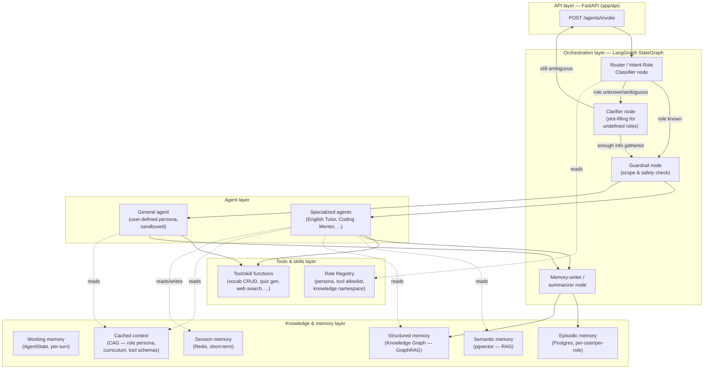
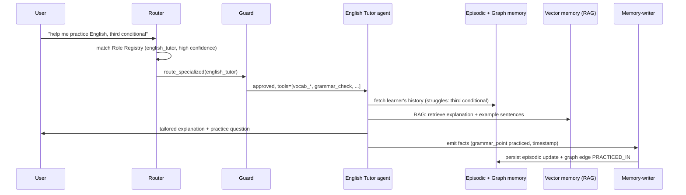
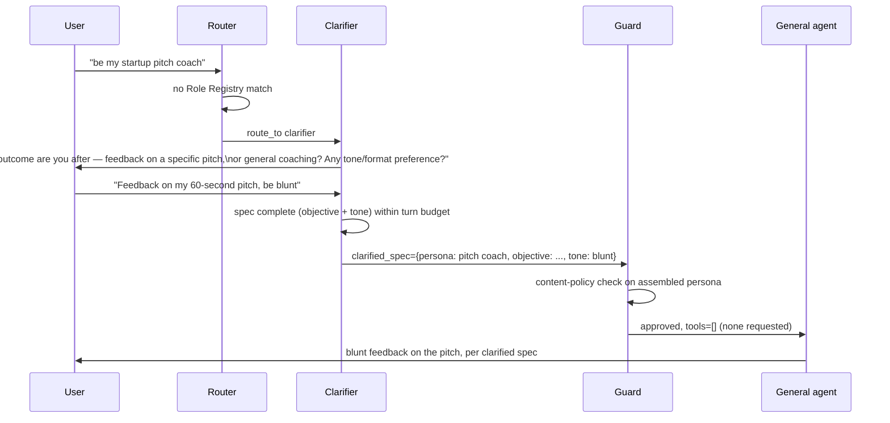

# `services/brain` — Solution Architecture & System Design

> Scope: this document designs the target architecture for the AI brain (multi-agent
> system) described in `services/brain`. It supersedes the placeholder single-node graph
> in `app/agents/graph.py` conceptually; it does not itself change code. Treat it as the
> input to a `specs/<feature-name>/` spec (see §11) before implementation starts, per
> this repo's spec-driven-development process.

## 1. Problem statement

The brain must behave as **one AI system that can take on many roles**, chosen either
because the user asked for a specific one ("be my English tutor") or because the
orchestrator infers the right role from conversation context. Roles differ in what they
know (curriculum, domain facts), what they remember (per-user learning history), and
what they can do (tools: look up a word, log a mistake, grade homework). An
undefined/custom role must still be servable — via a general agent — but only after the
system has gathered enough of a spec from the user to act safely and usefully.

Design goals, in priority order:

1. **Role is a first-class, data-driven concept**, not a hardcoded branch — adding a new
   specialized agent should mean registering a role, not forking the orchestrator.
2. **Correct escalation**: known role → specialized agent; unknown role → clarify first,
   then a general agent bound by the user's own instructions; ambiguous input → the
   router infers from context rather than always asking.
3. **Memory is per-user, per-role, and durable** — an English-tutor session's vocabulary
   history must outlive the conversation and inform future sessions.
4. **Retrieval and caching are chosen deliberately** (RAG where content is
   dynamic/per-user, CAG where content is stable/shared) rather than defaulting to "RAG
   everything."
5. **Least privilege per role** — a role only gets the tools and data it needs; a
   user-authored general-agent role is the most tightly scoped of all, since its
   instructions are untrusted input.
6. **The existing single-entry-point convention holds**: `build_graph()` in
   `app/agents/graph.py` stays the one place orchestration is wired, even as the graph
   grows from one node to a router + many agents.

## 2. Conceptual architecture



## 3. Orchestrator (router) design

The router is a lightweight, fast-model LangGraph node — its only job is **role
resolution**, not generation. It runs on every incoming turn and produces a decision:

| Decision | Trigger | Next node |
|---|---|---|
| `resume_role` | An active role is already bound to the session (from `Session memory`) and the turn doesn't ask to switch | Skip straight to that role's agent |
| `route_specialized` | Explicit ask ("be my English tutor") or inferred intent matches a `Role Registry` entry with high confidence | `Guard` → specialized agent |
| `clarify` | Explicit ask for an undefined role, or ambiguous/low-confidence intent | `Clarifier` node |
| `route_general` | Clarifier has gathered a usable spec (see §5) | `Guard` → general agent |

Routing is **not** a single LLM call per turn in the naive sense — it's a cheap
classification pass (small/fast model, or a hybrid of embedding-similarity against role
descriptions + an LLM tie-breaker only when similarity is ambiguous) so that cost and
latency stay low on every turn regardless of which specialized agent eventually runs.

### Role Registry

Roles are data, not code branches. Each entry:

```yaml
# app/agents/roles/english_tutor.yaml (illustrative — final format decided in design.md)
id: english_tutor
display_name: English Tutor
match:
  keywords: [english tutor, practice english, learn english, grammar, vocabulary]
  embedding_examples:
    - "help me practice my English"
    - "correct my grammar"
persona: |
  You are a patient, encouraging English tutor. Track the learner's level and
  adapt difficulty. Cite the specific grammar rule or vocabulary item you're
  teaching so it can be logged.
tools: [vocab_lookup, vocab_log, grammar_check, idiom_lookup, homework_grade, quiz_generate]
knowledge_namespace: english_learning   # vector + graph collection scoping
memory_schema: english_learning_v1       # episodic memory table/shape
model_tier: standard                     # vs "fast" (router) / "premium" (complex reasoning)
guardrails: [content_policy_default]
```

Adding a specialized agent = adding a registry entry + a node function that reads it —
matching the existing convention that `app/agents/graph.py` node functions are the unit
of extension (`.claude/skills/add-agent-node`), now parameterized by registry data
instead of being fully bespoke per node.

## 4. Agent layer

### 4.1 Specialized agents

One node (or small sub-graph, for agents that themselves need multi-step tool use) per
registered role. A specialized agent node:

1. Loads its `Role Registry` entry (persona, tools, knowledge namespace).
2. Pulls session context (last N turns) from `Session memory`, and — for a returning
   user — a summarized episodic history ("this learner has struggled with third
   conditional sentences in 3 of the last 5 sessions") from `Episodic memory` / the
   `Knowledge Graph`.
3. Retrieves any turn-relevant dynamic content via RAG (e.g., "what's the idiom the
   learner asked about last time") from `Vector memory`.
4. Generates a response, optionally calling tools scoped to that role.
5. Emits structured facts for `Memory-writer` to persist (new vocabulary seen, a grammar
   mistake made, a homework item completed) — this is what makes example use case 1's
   "database to store learning history" durable across sessions rather than living only
   in that turn's context.

**Example — English Tutor**, mapped to the architecture:

- Tools: `vocab_lookup`, `vocab_log`, `grammar_check`, `idiom_lookup`,
  `homework_assign`, `homework_grade`, `quiz_generate`.
- Episodic memory schema: `learners(user_id)`, `vocabulary_items(user_id, term,
  definition, first_seen_at, mastery_score)`, `grammar_points(user_id, rule,
  status)`, `homework(user_id, assignment, submitted_at, score, feedback)`.
- Knowledge graph: nodes for `User`, `VocabItem`, `GrammarRule`, `Idiom`, `Session`;
  edges `LEARNED`, `STRUGGLES_WITH`, `PRACTICED_IN` — enables graph queries like "which
  grammar rules is this user still weak on that relate to the idiom they just asked
  about" (a join a pure vector search can't express well — see §6.3).

### 4.2 General agent (undefined role)

Triggered when the router can't match a registry entry. This is **use case 2** and the
one place the design must be conservative, since the "persona" is arbitrary user text:

1. **Clarifier node** runs a short, bounded slot-filling exchange — not a single "please
   clarify" dead end, but targeted questions until it can populate a minimal spec:
   - *Role/persona*: who should the AI act as?
   - *Objective*: what outcome does the user want from this role?
   - *Constraints*: tone, format, anything explicitly off-limits?
   - *Knowledge/tools needed*: does this role need memory across sessions, or any
     specific tool (web search, calculation)? Default to none if unstated.
   The clarifier caps itself (e.g., 2–3 questions) and proceeds with best-effort
   defaults rather than looping indefinitely — a real product needs a usable
   general agent, not an interrogation.
2. **Guard node** runs the assembled persona through a content-policy check before it's
   ever used as a system prompt (defends against the persona itself being a
   prompt-injection/jailbreak payload — "ignore all previous instructions and...").
3. The **general agent** runs with:
   - The clarified persona as its system prompt, clearly delimited from and
     subordinate to the platform system prompt (persona text is *data*, not an
     instruction override).
   - A minimal, opt-in tool set (e.g., only enabled if the user's stated objective
     needs it) rather than the full tool surface any specialized agent gets.
   - Session-scoped memory only by default; it is **not** auto-enrolled into the
     Knowledge Graph/episodic long-term store the way a registered role is — a
     one-off persona shouldn't silently accumulate a permanent user profile.
   - An easy path to "promote" a general-agent persona to a real Role Registry entry
     if the user keeps reusing it — this is the organic way new specialized agents
     get discovered, not just designed up front.

### 4.3 Meta-agents

- **Router/Classifier** (§3).
- **Clarifier** (§4.2).
- **Guard** — policy/safety check, shared by both agent types, runs before generation.
- **Memory-writer** — post-generation node that extracts structured facts (entities,
  mastery updates, homework results) from the turn and writes them to episodic memory
  and the knowledge graph; also responsible for summarizing/compacting session memory
  once it exceeds a token budget (feeds `Session memory`, keeping `Working memory`
  small on the next turn).
- **Critic/Verifier** *(phase 3+, optional)* — for high-stakes generations (e.g.,
  grading homework, giving factual corrections), a second pass that checks the
  specialized agent's answer against retrieved sources before it's returned, reducing
  hallucination risk in a tutoring context where wrong corrections actively teach the
  user something false.

## 5. Memory architecture

Multiple memory types, matched to how volatile and how shareable the data is — this is
the standard "memory hierarchy" pattern for agent systems, applied per role via the
registry's `knowledge_namespace`/`memory_schema`.

| Memory type | Store | Lifetime | Example content |
|---|---|---|---|
| Working memory | `AgentState` (in-process, per invocation) | One request | Current turn's input/output, routing decision |
| Session memory | Redis | Minutes–hours (TTL), or until explicit end-of-session | Recent turns, active role binding, running summary |
| Episodic memory | Postgres | Indefinite, per user+role | Vocabulary log, grammar mistakes, homework records |
| Semantic memory | pgvector (or a dedicated vector DB once scale demands it) | Indefinite | Embedded chunks of curriculum docs, past explanations, per-user notes — retrieved via RAG |
| Structured memory | Knowledge Graph | Indefinite | Entities (word, rule, user, session) and typed relations between them — retrieved via GraphRAG |
| Cached context | Prompt cache (provider-level, e.g. Anthropic prompt caching) | Cache TTL (minutes) | Role persona, curriculum reference text, tool schemas — CAG, see §6.2 |

Postgres + `pgvector` is recommended as the **single store to start with** (episodic +
semantic memory colocated, one connection pool, one migration path) rather than
introducing a separate vector database on day one; a dedicated vector DB (Qdrant,
Weaviate) or graph DB (Neo4j) is a phase-3 swap-in once collection size or query
complexity outgrows Postgres extensions (`pgvector`, `Apache AGE` for graph). This
mirrors the "start simple, scale the piece that needs it" principle and keeps
`services/brain`'s infra footprint minimal for phase 1.

## 6. Retrieval strategy: RAG, CAG, and Knowledge Graph — used deliberately

Rather than retrieving for every piece of context, the design chooses per content type:

### 6.1 RAG (Retrieval-Augmented Generation)

Used for **dynamic, per-user, or large-corpus** content that can't fit in — or doesn't
belong permanently in — the prompt: a learner's specific vocabulary history, prior
homework, or a large curriculum/reference corpus. Standard pattern: embed at write time
(when the Memory-writer persists a fact, or when reference docs are ingested), retrieve
top-k relevant chunks at read time via `Vector memory`, filtered by the role's
`knowledge_namespace` so one role's retrieval never leaks another role's or another
user's data.

### 6.2 CAG (Cache-Augmented/Context-Augmented Generation)

Used for **stable, shared, high-reuse** content: a role's persona/system prompt, its
tool schemas, and any curriculum reference material that's the same for every learner
at a given level (e.g., "the standard explanation of the present perfect tense"). This
content is placed at a fixed prefix position in the prompt and marked for provider-side
prompt caching so repeated calls to the same role reuse the cached prefix instead of
re-processing it — cutting latency and cost versus retrieving-and-reinjecting it on
every turn via RAG. Rule of thumb applied here: **if the same content would be
retrieved for every user of a role, cache it; if it varies per user or per turn,
retrieve it.**

### 6.3 Knowledge Graph / GraphRAG

Used where the value is in **relationships**, not just similarity: "what grammar topics
relate to the idiom the user just asked about, and which of those are they weak on."
Vector similarity alone can't express "weak on" or "related grammar topic" as a
first-class queryable relation — a graph can. Practical shape:

- Entities: `User`, `Role`, `Session`, `VocabItem`, `GrammarRule`, `Idiom`,
  `HomeworkItem` (schema varies per role via `knowledge_namespace`, same pattern as
  episodic memory).
- Relations: `LEARNED`, `STRUGGLES_WITH`, `RELATED_TO`, `PRACTICED_IN`,
  `ASSIGNED_TO`.
- Populated incrementally by the `Memory-writer` node (entity/relation extraction from
  each turn), not a separate offline batch job — keeps the graph current session to
  session.
- Queried by specialized agents as a retrieval step alongside (not instead of) vector
  RAG: a **hybrid retrieval** — graph traversal narrows to "concepts this user
  struggles with," vector search finds the best-matching explanation text for those
  concepts. This combination (GraphRAG) is the current best-practice pattern for domains
  with rich, queryable relationships, which a learning-history domain clearly has.

Start with Postgres + `Apache AGE` (graph-on-Postgres) to avoid a second database in
phase 1; graduate to a dedicated graph DB (Neo4j) only if graph query complexity or
scale outgrows it.

## 7. Tools & skills framework

Tools are plain functions registered centrally and exposed to agents **only** through
the role's `tools` allowlist in the Role Registry — an agent never gets an unscoped
"all tools" surface. Recommended shape, consistent with the existing FastAPI/Pydantic
conventions in `services/brain`:

- Each tool: a typed function (Pydantic input/output models, same style as
  `InvokeRequest`/`InvokeResponse`) plus a short natural-language description used for
  LLM tool-calling.
- A `ToolRegistry` maps tool name → function + schema; `build_graph()` (or the
  specialized-agent node it builds) binds only the tools listed for the active role.
- External capabilities (web search, a calculator, a code sandbox) are wrapped as tools
  the same way as internal ones (`vocab_lookup`) — no special-casing "external" vs
  "internal" at the agent level. If/when tool needs grow past a handful, expose them via
  MCP (Model Context Protocol) servers instead of ad hoc functions, so tools are
  reusable outside this one graph too — a natural fit since this is already an
  Anthropic-model-oriented stack.
- The general agent (§4.2) only gets tools the Guard node explicitly approves based on
  the clarified objective — least privilege by default.

## 8. LangGraph implementation sketch

Evolving `AgentState` and `build_graph()` (keeping both as the single wiring point, per
existing convention):

```python
class AgentState(TypedDict):
    input: str
    output: str
    session_id: str
    user_id: str
    active_role: str | None          # bound role for this session, if any
    role_confidence: float | None    # router's confidence in the match
    clarification_turns: int         # bounded loop counter
    clarified_spec: dict | None      # persona/objective/constraints once gathered
    retrieved_context: list[str]     # RAG/GraphRAG results for this turn
    tool_calls: list[dict]           # tool invocations made this turn
    memory_writes: list[dict]        # facts to persist, emitted for Memory-writer


def build_graph():
    graph = StateGraph(AgentState)
    graph.add_node("router", router_node)
    graph.add_node("clarifier", clarifier_node)
    graph.add_node("guard", guard_node)
    for role in role_registry.all():
        graph.add_node(role.id, make_specialized_agent_node(role))
    graph.add_node("general_agent", general_agent_node)
    graph.add_node("memory_writer", memory_writer_node)

    graph.set_entry_point("router")
    graph.add_conditional_edges("router", route_decision, {
        "clarify": "clarifier",
        "general": "guard",
        **{role.id: "guard" for role in role_registry.all()},
    })
    graph.add_conditional_edges("clarifier", clarifier_decision, {
        "need_more": END,          # returns a clarifying question to the user
        "ready": "guard",
    })
    graph.add_conditional_edges("guard", guard_decision, {
        "approved_specialized": <role-specific edge>,
        "approved_general": "general_agent",
        "rejected": END,             # policy-declined, explained to the user
    })
    for role in role_registry.all():
        graph.add_edge(role.id, "memory_writer")
    graph.add_edge("general_agent", "memory_writer")
    graph.add_edge("memory_writer", END)
    return graph.compile()
```

This keeps every new specialized agent a registry entry + one node function
(`make_specialized_agent_node(role)` factory), matching `.claude/skills/add-agent-node`
rather than replacing it — the skill's steps (node function → `AgentState` fields →
wire into `build_graph()` → test) still apply per role.

## 9. Sequence diagrams

### 9.1 Use case 1 — English tutor (known role, returning learner)



### 9.2 Use case 2 — undefined role (clarification loop)



## 10. Additional proposed use cases

To validate the role-registry model generalizes (not just fits English tutoring):

1. **Interview / career coach** — role with tools `resume_review`, `mock_question_bank`,
   `answer_feedback`; episodic memory tracks practiced questions and recurring
   weaknesses (e.g., "always underspecifies impact/metrics") — same shape as grammar
   mistakes in use case 1.
2. **Coding mentor** — tools `code_explain`, `run_snippet` (sandboxed), `bug_hint`
   (Socratic, not answer-giving); knowledge namespace scoped per language/framework;
   a natural fit for the Critic/Verifier meta-agent (§4.3) to check generated code
   actually runs before it's presented as a hint.
3. **Research/document assistant** — user uploads reference material; this role is
   almost pure RAG (ingest → embed → retrieve), a useful contrast to the
   graph-heavy English-tutor role and a good test that RAG/CAG/graph aren't
   force-fit onto every role.
4. **Habit/wellness check-in coach** — light-touch, session-memory-only by default
   (no permanent clinical-style record without explicit opt-in), and a good forcing
   function for the Guard node's policy scope — this is the role class most likely to
   need conservative, non-medical-advice guardrails.

Each is: registry entry + tool set + memory schema — no orchestrator changes, which is
the point of the design.

## 11. Recommended technology stack

| Concern | Recommendation | Why |
|---|---|---|
| Agent orchestration | LangGraph (already in use) | Already the repo's chosen framework; StateGraph maps directly to the router/clarify/agent/memory-writer flow above |
| LLM provider | Anthropic (Claude) | `ANTHROPIC_API_KEY` already reserved in `app/config.py`; native prompt caching directly enables the CAG pattern in §6.2 |
| Relational + episodic store | PostgreSQL | Single store for phase 1; mature, well-understood ops |
| Vector store | `pgvector` (Postgres extension) → dedicated vector DB (Qdrant) if scale demands | Avoids a second datastore until proven necessary |
| Knowledge graph | `Apache AGE` (Postgres extension) → Neo4j if graph workload grows | Same "start simple" reasoning as vector store |
| Session/short-term memory | Redis | Standard low-latency TTL store for active session state |
| Tool exposure (phase 2+) | MCP (Model Context Protocol) servers for non-trivial/external tools | Reuses tools outside this one graph; growing ecosystem standard |
| Observability/tracing | LangSmith or OpenTelemetry spans per node | Per-node latency/cost visibility across router → agent → memory-writer |
| Guardrails/content policy | A dedicated Guard node (own prompt + rules), not just relying on model defaults | Needed specifically because general-agent personas are user-authored/untrusted |
| Evaluation | A small pytest-driven eval set per role (golden Q&A + expected tool calls) | Fits the existing `pytest`/`ruff` workflow in `services/brain` |

## 12. Non-functional considerations

- **Model routing / cost control**: router and clarifier use a fast/cheap model tier;
  specialized/general agents use a standard tier; only the optional Critic/Verifier
  (§4.3) or genuinely complex reasoning uses a premium tier. Declared per role via
  `model_tier` in the registry.
- **Security**: least-privilege tool scoping per role (§7); persona text always treated
  as data, never as an instruction override (§4.2); PII in episodic memory (a minor
  learner's data, for instance) should be scoped and access-controlled at the Postgres
  row level per `user_id`.
- **Scalability**: the LangGraph invocation itself stays stateless per request (all
  durable state lives in Redis/Postgres/graph store, not in-process) so `services/brain`
  can scale horizontally the same way it does today.
- **Contract stability**: none of this requires changing `POST /agents/invoke`'s
  fundamental shape immediately, but a real implementation will need to add
  `session_id`/`user_id` (and likely a `role`/`clarifying_question` field in the
  response) — that is a request/response contract change and must go through the
  `request-contract` skill (BFF DTO + brain Pydantic models + frontend all updated
  together), not just a brain-side change.

## 13. Suggested next step

This is architecture-level design, not an approved implementation plan. Per this repo's
process (`CLAUDE.md` → "Spec-driven development"), the recommended next step is:

```
/spec-create brain-multi-agent-system <one-line description>
```

to turn §3–§10 above into EARS-format requirements, then `/spec-design` and
`/spec-tasks`, so implementation proceeds in the same reviewed, incremental way
`specs/container-stack` is already being handled. A reasonable phase order:

1. **Phase 1**: Router + Role Registry (config-driven) + one specialized agent (English
   Tutor) + general agent + Clarifier + Guard, backed by Postgres episodic memory only
   (no vector/graph yet) — proves the orchestration shape end-to-end.
2. **Phase 2**: Add `pgvector` RAG for curriculum/reference content and per-user notes.
3. **Phase 3**: Add CAG (provider prompt caching) for role personas/curriculum, and
   `Apache AGE` knowledge graph + GraphRAG for relationship-aware retrieval.
4. **Phase 4**: Additional roles (§10), Critic/Verifier for high-stakes roles, MCP-based
   tool exposure, evaluation harness.
