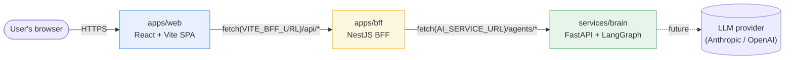
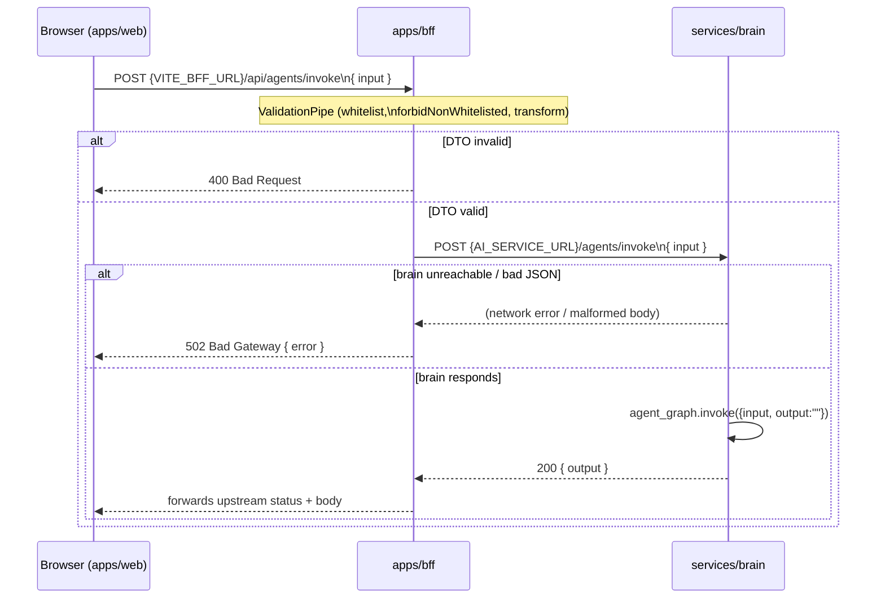
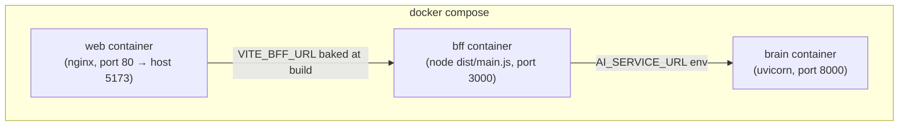

# High-Level Architecture

## 1. Overview

This repository is a three-tier monorepo for an AI-assisted application. Each tier is an
independently managed app — its own lockfile, its own `node_modules`/`.venv`, no
pnpm/turbo workspace tooling tying them together — but they compose into a single request
path:

```
apps/web  →  apps/bff  →  services/brain
(browser)     (/api/*)      (/agents/*)
```

- **`apps/web`** — the only thing the end user's browser talks to. A React SPA with no
  server-side logic of its own.
- **`apps/bff`** — "backend for frontend." The single point of contact between the
  browser and the rest of the system. Owns request validation, auth (future), and
  proxying to the AI service.
- **`services/brain`** — an internal, non-browser-facing Python service that runs a
  LangGraph multi-agent graph behind a small FastAPI HTTP surface.

The AI service is deliberately never reachable from `apps/web` directly — every call to
it is mediated by `apps/bff`, which is where cross-cutting concerns (validation, error
shaping, future auth/rate-limiting) live.

## 2. System context



There is no database, message queue, or auth provider wired in yet — the stack today is
purely the three HTTP tiers above plus (planned, not yet wired) an outbound call from
`services/brain` to an LLM provider.

## 3. Tier breakdown

### 3.1 `apps/web` — frontend SPA

| | |
|---|---|
| Stack | React 19, Vite 8, TypeScript, Vitest + Testing Library |
| Talks to | `apps/bff` only, via `VITE_BFF_URL` (default `http://localhost:3000`) |
| Contains | No backend logic — pure client rendering |
| Entry points | `src/main.tsx` → `src/App.tsx` |

`apps/web` is a static build (served via its `Dockerfile`/nginx in containers, or Vite's
dev server locally). It never talks to `services/brain` directly, and it never sees
`AI_SERVICE_URL` — only `VITE_BFF_URL`, baked in at build time.

### 3.2 `apps/bff` — NestJS backend-for-frontend

| | |
|---|---|
| Stack | NestJS 11, `class-validator`/`class-transformer`, `@nestjs/config` |
| Talks to | `services/brain` only, via `AI_SERVICE_URL` (default `http://localhost:8000`) |
| Structure | One feature module per resource under `src/*/` |
| Global prefix | `/api` (set in `src/main.ts`) |

Modules today:

- **`src/health`** (`GET /api/health`) — liveness probe, returns `{ status: "ok" }`.
- **`src/agents`** (`POST /api/agents/invoke`) — the proxy route:
  - `dto/invoke-agent.dto.ts` — `InvokeAgentDto { input: string }`, validated by a
    global `ValidationPipe({ whitelist: true, forbidNonWhitelisted: true, transform: true })`.
  - `agents.controller.ts` — thin HTTP layer, delegates to the service, forwards the
    upstream status code and body verbatim to the caller.
  - `agents.service.ts` — calls `POST {AI_SERVICE_URL}/agents/invoke` with the
    validated DTO as JSON. A network failure or an unparseable upstream response is
    mapped to `502 Bad Gateway` with `{ error: <message> }` — the BFF never lets a raw
    upstream/network exception leak to the client.

This module is the template for every new upstream call: DTO → global validation →
service that fetches the upstream and maps failures to `502`. (See
`.claude/skills/add-bff-route` / `.claude/agents/bff-route.md` for the scaffolding
command.)

Config is read via `ConfigService` (`AI_SERVICE_URL`, `PORT`), sourced from
`ConfigModule.forRoot({ isGlobal: true })` — `apps/bff` has no `.env.example` since its
only two settings default sensibly (`http://localhost:8000`, `3000`).

### 3.3 `services/brain` — Python multi-agent service

| | |
|---|---|
| Stack | Python ≥3.14, FastAPI, LangGraph, Pydantic v2 / `pydantic-settings` |
| Talks to | Nothing yet outbound (LLM provider call is a future addition) |
| Called by | `apps/bff` only |

- **`app/main.py`** — `FastAPI(title=settings.app_name)`, mounts `app/api/routes.py`'s
  router with no prefix.
- **`app/api/routes.py`** — the HTTP surface:
  - `GET /health` → `{ "status": "ok" }`
  - `POST /agents/invoke` → `InvokeRequest { input: str }` in, `InvokeResponse { output: str }`
    out; invokes the compiled `agent_graph` with `{"input": ..., "output": ""}` and
    returns `result["output"]`.
- **`app/agents/graph.py`** — the single entry point for multi-agent orchestration.
  `AgentState` (`TypedDict`) is the shared state threaded through every node.
  `build_graph()` wires node functions into a LangGraph `StateGraph`; `agent_graph` is
  compiled once at import time and reused across requests. Today it has one node
  (`planner_node`, a placeholder echo) wired straight to `END` — new agents are added as
  node functions here and connected via `graph.add_edge`/conditional edges. (See
  `.claude/skills/add-agent-node`.)
- **`app/config.py`** — `Settings(BaseSettings)` loaded from `.env` /
  `services/brain/.env.example` (`app_name`, `host`, `port`; commented-out slots for
  `anthropic_api_key`/`openai_api_key` reserved for when a real LLM call is added).

## 4. Request flow — `POST /agents/invoke`



This is the pattern `.claude/skills/trace-flow` walks automatically for any endpoint.

## 5. Deployment topology



- Each app has its own `Dockerfile`; the root `docker-compose.yml` builds and wires all
  three (`docker compose up --build`), exposing web on `:5173`, bff on `:3000`, brain on
  `:8000`.
- `apps/bff`'s image is a production build: `nest build` → `dist/main.js`, run with
  `node dist/main.js` (no dev-server dependency at runtime).
- **Known gap (tracked in `specs/container-stack/requirements.md`, draft):** the
  checked-in `docker-compose.yml` currently sets the bff's `AI_SERVICE_URL` to
  `http://ai:8000`, but the compose service is actually named `brain` — so a compose run
  today gets a `502` on the `bff → brain` hop until that spec lands. The service names,
  healthchecks (`service_healthy` gating), the web image's `VITE_BFF_URL` build-arg, and
  a real `services/brain/.env` override path are all in scope there — see that spec
  before relying on `docker compose up` end-to-end.

## 6. Configuration surface

| Tier | Variable | Default | Purpose |
|---|---|---|---|
| `apps/web` | `VITE_BFF_URL` | `http://localhost:3000` | Base URL the SPA calls; baked in at build time |
| `apps/bff` | `AI_SERVICE_URL` | `http://localhost:8000` | Upstream brain service base URL |
| `apps/bff` | `PORT` | `3000` | HTTP listen port |
| `services/brain` | `HOST` | `0.0.0.0` | uvicorn bind host |
| `services/brain` | `PORT` | `8000` | uvicorn bind port |
| `services/brain` | `ANTHROPIC_API_KEY` / `OPENAI_API_KEY` | *(unset)* | Reserved for the LLM provider call agent nodes will eventually make |

`apps/bff` has no `.env.example` — its two settings default sensibly and are documented
in `CLAUDE.md` instead of a template file. `apps/web` and `services/brain` each ship a
`.env.example` to copy to `.env`.

## 7. Testing strategy per tier

- **`apps/web`** — Vitest + Testing Library, `pnpm test` (single run) / `test:watch`.
- **`apps/bff`** — Vitest for both layers: unit specs under `src/**/*.spec.ts` using
  `@nestjs/testing`'s `Test.createTestingModule` to instantiate one controller/service in
  isolation, and e2e specs under `test/*.e2e-spec.ts` that boot the real `AppModule` and
  drive it over HTTP with `supertest` — the e2e layer is what actually proves a
  validation failure returns `400` and an upstream failure returns `502` over the wire.
  Requires `unplugin-swc` as the Vitest transform, since plain esbuild doesn't emit the
  `design:paramtypes` metadata Nest's DI / `class-validator` depend on.
- **`services/brain`** — `pytest` (`tests/`), `ruff check .` for linting.

All three are standardized on their respective test runner regardless of what each
framework's own tooling would default to (Vitest for every TypeScript app in this repo,
`pytest` for the Python service).

## 8. Cross-cutting conventions

- **Validation happens at the BFF**, not in `services/brain` — every upstream call from
  `apps/bff` is preceded by a `class-validator` DTO under the global `ValidationPipe`.
  `services/brain` still declares its own Pydantic request/response models
  (`InvokeRequest`/`InvokeResponse`) as a second line of defense and as FastAPI's
  self-documentation, but the BFF is the enforcement boundary the frontend is guaranteed
  to hit first.
- **Upstream failures never leak raw exceptions** — `agents.service.ts`'s
  `toBadGateway()` pattern (network error or unparseable JSON → `502 { error }`) is the
  template for any new BFF service that calls out to `services/brain`.
- **One feature module per resource** in `apps/bff` (`src/agents/`, `src/health/`), each
  with its own controller/service/DTO/spec — new BFF endpoints follow this shape (see
  `.claude/skills/add-bff-route`).
- **`app/agents/graph.py` is the only place agent orchestration is wired** in
  `services/brain` — new agents are node functions added there and connected into
  `build_graph()`, not scattered across the codebase (see
  `.claude/skills/add-agent-node`).
- **Spec-driven development** — non-trivial features go through
  `specs/<feature-name>/requirements.md` → `design.md` → `tasks.md`, each gated by
  explicit human approval, before implementation (see `specs/README.md` and the
  `spec-driven-development` skill). `specs/container-stack/` is the current in-flight
  example, hardening the compose wiring described in §5.

## 9. Current limitations / not yet built

- No persistence layer (database, cache) anywhere in the stack.
- No authentication/authorization on any tier.
- `services/brain`'s agent graph is a single placeholder node (`planner_node`) that
  echoes its input — no real LLM call is wired in yet, though `Settings` reserves
  `ANTHROPIC_API_KEY`/`OPENAI_API_KEY` for when one is added.
- `apps/web`'s `App.tsx` is still the Vite starter scaffold, not product UI.
- The compose wiring bug in §5 (`ai` vs `brain` hostname) means `docker compose up`
  does not yet produce a working end-to-end stack until `specs/container-stack` is
  implemented.
