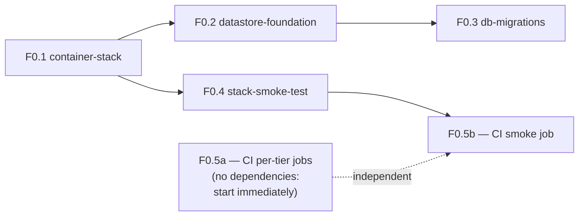

# Phase 0 features — Runnable foundation

> Decomposition of [Phase 0](phrases.md#3-phase-0--runnable-foundation) into discrete,
> independently reviewable features. Each one below becomes a `specs/<feature-name>/`
> folder via `/spec-create`, then `/spec-design` → `/spec-tasks` → `/spec-execute`, with a
> human approval gate between each. Nothing here is a spec yet — this is the list of specs
> to write, and the order to write them in.
>
> **Phase 0 delivers no user-visible behavior.** Its entire output is: the stack runs, the
> datastores exist, and CI proves both on every change. Resist adding agent behavior here;
> that starts in Phase 2.

## Feature list

| # | Feature (spec folder) | Goal | Depends on | Size |
|---|---|---|---|---|
| F0.1 | `container-stack` | Make the existing three-tier compose stack actually start and connect | — | M |
| F0.2 | `datastore-foundation` | Postgres and Redis exist, and brain can reach them | F0.1 | M |
| F0.3 | `db-migrations` | Schema changes are versioned, applied, and reversible | F0.2 | S |
| F0.4 | `stack-smoke-test` | One command proves the whole stack works, locally and in CI | F0.1 (F0.2 for datastore assertions) | S |
| F0.5 | `ci-pipeline` | Every PR runs lint + tests for all three tiers, plus the smoke test | — (smoke job needs F0.4) | M |

## Recommended order



**F0.5a can start today**, in parallel with everything else: running `pnpm test`,
`pnpm lint`, `pytest`, and `ruff check` in CI needs no working compose stack, and it starts
protecting the repo immediately. The rest is a chain, because each link is what makes the
next one verifiable.

---

## F0.1 — `container-stack`

**Status: `requirements.md` already drafted, awaiting approval.** Do not reopen or widen
it — it is correctly scoped to *fixing what is broken*, and F0.2 adds *what is missing*.
Keeping the two apart means two small reviewable specs rather than one sprawling one.

**Goal:** `docker compose up --build` brings up web, bff, and brain, correctly wired,
from a clean clone.

Already covered by its five drafted requirements: the `AI_SERVICE_URL` → `brain` fix, a
real `services/brain/.env` override path, the web image's `VITE_BFF_URL` build arg,
healthchecks with `depends_on: condition: service_healthy` and a restart policy, and
updating the `run-stack` skill to match.

**Next action:** approve `specs/container-stack/requirements.md`, then `/spec-design container-stack`.

**Note for F0.2:** its Requirement 4.1 specifies the brain healthcheck calls `GET /health`.
F0.2 introduces a liveness/readiness split and will supersede that specific criterion —
call this out explicitly in F0.2's requirements so the change is deliberate rather than
looking like drift.

---

## F0.2 — `datastore-foundation`

**Goal:** Postgres and Redis run as part of the stack, and `services/brain` connects to
both with configuration that follows existing conventions.

**In scope**

- Postgres and Redis services in `docker-compose.yml`: pinned image tags, named volumes
  for persistence, healthchecks, and restart policy consistent with F0.1's.
- Connection settings in `app/config.py` via `pydantic-settings` — `DATABASE_URL` and
  `REDIS_URL`, never scattered `os.environ` reads (per the `brain-agent` conventions).
- Brain dependencies: an async Postgres driver and client (`asyncpg` + SQLAlchemy async,
  or equivalent) and `redis` — added to `pyproject.toml`.
- Connection lifecycle: pools created at FastAPI startup, closed at shutdown, shared
  rather than per-request.
- `services/brain/.env.example` documents both new variables with compose-internal
  defaults.
- **Liveness vs readiness split**: `GET /health` stays a pure process-liveness check that
  does *not* touch the datastores; a new `GET /health/ready` reports Postgres and Redis
  reachability. Compose's healthcheck points at readiness; nothing restarts the container
  merely because Postgres blipped.

**Out of scope**

- Any table, model, or ORM entity — F0.3 owns schema, and the tables themselves belong to
  Phase 2.
- Caching or session logic. Redis is provisioned here and *used* in Phase 1 (sessions) and
  Phase 2 (router cross-turn state).

**Key decision to resolve in `design.md` — the Postgres image.** The design needs
`pgvector` in Phase 3 and `Apache AGE` in Phase 4, and the common `pgvector/pgvector`
image does not ship AGE. Three honest options: pick a community image carrying both, build
a small custom image, or start on `pgvector/pgvector` and accept an image migration when
Phase 4 lands. Any of these is defensible; discovering the constraint in Phase 4 is not.
Whichever is chosen, enable the extensions in F0.3's baseline migration so the decision is
recorded in code.

**Acceptance criteria (sketch — EARS form belongs in `requirements.md`)**

1. `docker compose up --build` starts five services; `docker compose ps` shows Postgres
   and Redis healthy.
2. `GET /health` returns `200` even with Postgres stopped; `GET /health/ready` returns a
   non-healthy status naming the unreachable dependency.
3. Restarting the stack preserves Postgres data (volume, not ephemeral).
4. No connection string appears in any committed file except as a placeholder default.

---

## F0.3 — `db-migrations`

**Goal:** schema changes are versioned and applied the same way in local dev, compose, and
CI — before anyone needs the first real table.

**In scope**

- Alembic configured against the brain's settings (reusing `DATABASE_URL`, not a second
  source of truth).
- An empty baseline revision, plus `CREATE EXTENSION` statements for whatever F0.2's image
  decision settled on.
- A documented answer to **when migrations run**: explicitly chosen among an entrypoint
  step, a one-shot compose service, or a manual command — not left implicit. Automatic
  application on container start is convenient in dev and dangerous in production, so the
  spec should say which environments do which.
- Commands documented in `CLAUDE.md`'s brain section alongside `pytest`/`ruff`.
- CI applies migrations to a throwaway database (feeds F0.5).

**Out of scope**

- Actual tables. The first ones arrive with Phase 2's Role Instances.
- Seed/fixture data.

**Acceptance criteria (sketch)**

1. A developer can generate a revision, apply it, and downgrade it, following only the
   documented commands.
2. A fresh database plus `alembic upgrade head` yields the expected extensions installed.
3. Applying migrations twice is a no-op, not an error.

---

## F0.4 — `stack-smoke-test`

**Goal:** turn Phase 0's exit criteria into something executable, so "the stack works" is
a command rather than a claim.

**In scope**

- A script (committed, runnable locally) that walks the documented smoke path against a
  running stack: brain `GET /health` → brain `GET /health/ready` → bff `GET /api/health` →
  `POST /api/agents/invoke` with a valid body expecting `200`, and with an invalid body
  expecting `400`.
- A clear pass/fail exit code and readable output naming which hop failed — this is the
  first thing anyone runs when the stack misbehaves.
- Sensible waiting for readiness rather than fixed sleeps.
- Referenced from the `run-stack` skill as the canonical "did it work?" step.

**Out of scope**

- Browser/UI testing. There is no UI worth testing until Phase 1.
- Load or performance testing.

**Why it is its own feature:** it is the executable form of the phase gate, it is useful
locally on day one, and F0.5 consumes it rather than reimplementing the same assertions
in YAML.

**Acceptance criteria (sketch)**

1. Against a healthy stack, the script exits `0`.
2. With `brain` stopped, it exits non-zero and the output identifies the failing hop
   (the invoke call surfacing as the BFF's `502`).
3. It requires no arguments for the default local ports, but accepts base-URL overrides.

---

## F0.5 — `ci-pipeline`

**Goal:** every pull request proves all three tiers still lint, test, and run together.

**In scope — two jobs with different dependencies, landable as two PRs**

*F0.5a — per-tier checks (no dependency on anything else; do this first):*

- `apps/web`: `pnpm lint` + `pnpm test`
- `apps/bff`: `pnpm lint` + `pnpm test` (unit specs under `src/`, e2e under `test/`)
- `services/brain`: `ruff check .` + `pytest`
- Pinned Node/pnpm and Python versions matching each app's config; dependency caching;
  jobs run in parallel and report independently, so a Python failure does not mask a
  TypeScript one.

*F0.5b — integration check (needs F0.4):*

- Build the stack, bring it up, apply migrations, run F0.4's smoke script, tear down.
- Upload container logs on failure — a red integration job with no logs wastes more time
  than it saves.

**Out of scope**

- Deployment, publishing images, release automation. Phase 0 proves correctness; it does
  not ship anything.
- Branch protection rules (a repo setting, not a spec).

**Acceptance criteria (sketch)**

1. Opening a PR triggers all four jobs; each reports separately.
2. A deliberately broken test in any one tier fails that tier's job and only that one.
3. The integration job catches a regression of the original `AI_SERVICE_URL` bug — this is
   the specific regression Phase 0 exists to prevent recurring.

---

## Explicitly deferred out of Phase 0

Named here because each is individually tempting and collectively a way to never finish
the foundation:

| Deferred | Where it belongs |
|---|---|
| Structured logging, tracing, metrics | Phase 4 (`observability`) — pull forward only if Phase 2 debugging demands it |
| Auth, users table, sessions | Phase 1 (`auth-and-session`) |
| Any `role_*` table | Phase 2 (`role-registry-and-instances`) |
| pgvector indexes / AGE graph setup | Phases 3 and 4 — F0.2/F0.3 only decide the image and enable extensions |
| Kubernetes, staging environments, IaC | Not yet scoped; compose is the target runtime for now |

## Kicking it off

```sh
# 1. Approve the drafted spec, then continue it:
/spec-design container-stack

# 2. In parallel, start the zero-dependency CI work:
/spec-create ci-pipeline "Run lint and tests for web, bff, and brain on every PR, plus an integration job running the stack smoke test"

# 3. Then, in dependency order:
/spec-create datastore-foundation "Add Postgres and Redis to the stack with brain connectivity, config, and a liveness/readiness health split"
/spec-create db-migrations "Version brain schema changes with Alembic, including how migrations apply in dev, compose, and CI"
/spec-create stack-smoke-test "A committed script that verifies the full request path across a running stack, used locally and by CI"
```

`/spec-status` at any point shows where each of these stands.
