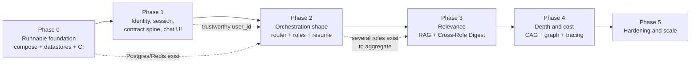

# Development Phases — implementing the whole system

> **What this is.** A sequencing plan for building the system described in
> [`architecture/high-level-architecture.md`](../architecture/high-level-architecture.md)
> (the three tiers as they exist) and
> [`architecture/brain-architecture.md`](../architecture/brain-architecture.md) (the
> multi-agent design). Those documents say *what* to build; this one says *in what order,
> and why that order*.
>
> **What this is not.** Not a spec. Per `CLAUDE.md`, each phase's work still goes through
> `specs/<feature-name>/` (`requirements.md` → `design.md` → `tasks.md`, human-approved at
> each gate) before code is written. Each phase below names the spec folders it should
> produce.

## 1. Where the system actually is today

| Tier | State | Gap to the target design |
|---|---|---|
| `apps/web` | Vite starter scaffold (`App.tsx` is the logo/counter demo), Vitest wired, one test | No product UI at all — nothing can be *seen* working |
| `apps/bff` | Real: `POST /api/agents/invoke` proxy with DTO validation, `502` mapping, health, unit + e2e specs | No auth, no session, no user identity |
| `services/brain` | FastAPI + a single placeholder `planner_node` that echoes `"planned: {input}"` | Everything in `brain-architecture.md` |
| Infra | Three Dockerfiles + `docker-compose.yml` | Compose is **broken** (`AI_SERVICE_URL: http://ai:8000` names a service that doesn't exist); no Postgres, no Redis, no CI |
| Specs | `specs/container-stack/requirements.md` — **Draft, awaiting approval** | Everything else |

So: the skeleton and the conventions are real, the behavior is not.

## 2. Why this order

Four constraints drive the sequencing more than feature priority does.

1. **Nothing is verifiable until compose works.** `docker compose up --build` currently
   produces a `502` on the `bff → brain` hop. Every phase's exit criteria are
   "demonstrate X end to end," so fixing the stack is the precondition for having exit
   criteria at all.
2. **Identity must precede memory.** The entire isolation model in
   `brain-architecture.md` keys off `user_id` — Role Instances are unique per
   `(user_id, role_key)`, digest assembly filters by it, RAG namespaces are scoped by it.
   There is no auth anywhere in the stack today. Building per-user memory *first* means
   either building on a spoofable identity or retrofitting auth into the exact tables
   that hold users' personal history. Auth is therefore phase 1, not a later
   "hardening" item.
3. **Change the cross-tier contract once, early.** Adding a field to the invoke payload
   is a three-tier operation (the `request-contract` skill exists precisely because of
   this). Establishing the envelope — `session_id`, a server-derived `user_id`, and role
   metadata on the response — in one early phase means later phases add fields inside an
   established pattern instead of renegotiating the contract four more times.
4. **Build the UI early, not last.** With `apps/web` still a scaffold, every phase after
   this is otherwise demoed by `curl`. A minimal chat UI in phase 1 makes phases 2–5
   observable by a human, which is how routing quality — the actual product risk — gets
   judged.

**Phase gate.** A phase is done when: its specs are approved and implemented, its exit
criteria are demonstrable on the running stack (not just in unit tests), all three tiers'
test suites are green, and `CLAUDE.md` / the `run-stack` skill still describe reality.

## 3. Phase 0 — Runnable foundation

**Goal:** the stack starts, the three tiers actually reach each other, the datastores the
design needs exist, and CI proves all of it on every change.

| Tier | Work |
|---|---|
| Infra | Fix `AI_SERVICE_URL` → `http://brain:8000`; healthchecks on `bff`/`brain`; `depends_on: condition: service_healthy`; `VITE_BFF_URL` as a web build-arg; real `services/brain/.env` override path — this is exactly `specs/container-stack` |
| Infra | Add **Postgres** and **Redis** to compose, with volumes, healthchecks, and env wiring into `brain` |
| `services/brain` | DB/Redis connection config via `pydantic-settings` (not scattered `os.environ`); migration tooling (Alembic) scaffolded with an empty baseline; health endpoint reports datastore reachability |
| CI | GitHub Actions: `pnpm test`/`lint` for web and bff, `pytest`/`ruff check` for brain, on every PR |

**Specs to produce:** `container-stack` (drafted — needs approval), `datastore-foundation`.

**Exit criteria:** from a clean clone, `docker compose up --build` followed by the
documented smoke test (brain health → bff health → `POST /api/agents/invoke`) succeeds;
brain reports Postgres and Redis healthy; CI is green on all three tiers.

**Explicitly not in this phase:** any agent behavior, any schema beyond an empty
migration baseline, any auth.

**Decision to make here, because phase 4 depends on it:** which Postgres image. The
design wants both `pgvector` (phase 3) and `Apache AGE` (phase 4), and the common
`pgvector/pgvector` image does **not** ship AGE. Either pick or build an image carrying
both now, or consciously accept that phase 4 opens with a database migration. Deciding
this in phase 0 costs an hour; discovering it in phase 4 costs a migration under load.

## 4. Phase 1 — Identity, session, and the contract spine

**Goal:** the system knows *who* is talking, through a real UI, over a request/response
envelope that will not need renegotiating every phase.

| Tier | Work |
|---|---|
| `apps/bff` | Authentication and session management; `user_id` derived **server-side** from the authenticated session and attached when forwarding to brain; session storage in Redis |
| `services/brain` | Request model accepts `user_id`/`session_id` from its trusted caller and **ignores any client-supplied `user_id`**; response model gains role metadata (`role`, `display_name`, `clarifying_question`) — nullable now, populated in phase 2. Graph is still the placeholder node |
| `apps/web` | Replace the Vite scaffold with a real chat UI: message list, composer, conversation state, login/logout, error states for `400`/`502` |
| Contract | The above crosses all three tiers — follow the `request-contract` skill so the BFF DTO, brain Pydantic models, and frontend types change together |

**Specs to produce:** `auth-and-session`, `chat-ui`. (The contract change rides along with
whichever lands first — it is not its own feature.)

**Exit criteria:** a logged-in user holds a conversation with the placeholder brain
through the real UI; two users' requests are distinguishable server-side; an e2e test
proves a forged `user_id` in the request body is ignored in favour of the session-derived
one.

**Explicitly not in this phase:** roles, routing, persisted conversation, memory of any
kind. The brain still echoes.

**Scope warning:** "auth" can absorb unlimited time. Pick the simplest credible option in
the spec (session cookie plus a `users` table, or a hosted OIDC provider) and timebox it —
the goal is a *trustworthy* `user_id`, not an identity product.

## 5. Phase 2 — Orchestration shape

*(= `brain-architecture.md` §13 phase 1 — the largest phase; split it across several specs.)*

**Goal:** the role model works end to end — plain chat stays plain, a registered role
answers with its own tools and history, an unregistered role gets clarified, and all of it
resumes tomorrow.

| Tier | Work |
|---|---|
| `services/brain` | Router with the **ordered** decision table and its cross-turn Redis state (role binding plus pending template draft — without these the Clarifier loop cannot work across turns); Role Registry (config-driven); Agent Template schema and fulfillment; Clarifier; Guard; Default assistant; General agent; **English Tutor** as the first specialized role |
| `services/brain` | Postgres: `role_instances`, `role_conversation_state`, `role_knowledge_facts`, plus the English Tutor's own tables; `Memory-writer` wired as **post-response** work, never blocking the reply |
| `apps/bff` | Pass role metadata through; no new business logic |
| `apps/web` | Show which role is answering, render clarifying questions as a conversational turn, offer an explicit "leave this role" affordance |
| Evals | The **routing eval set** — turns labelled with their expected decision. Build it *in* this phase, not after |

**Specs to produce:** `agent-router` (router, cross-turn state, default assistant),
`role-registry-and-instances` (template, registry, Role Instance persistence, Clarifier,
Guard, general agent), `english-tutor-role`. Three approval gates instead of one
unreviewable spec.

**Exit criteria — all four demonstrable in the UI:**

1. "What's the capital of France?" → plain answer, no role, no clarification.
2. "Be my English tutor" → tutor responds; vocabulary and grammar facts land in Postgres.
3. "Be my startup pitch coach" → targeted clarifying question, then an on-spec answer.
4. Log in the next day → both roles resume with their prior context.

Plus: the routing eval suite is green, and response latency does not include
`Memory-writer`'s work.

**Explicitly not in this phase:** RAG, knowledge graph, cross-role digest, prompt caching.
Resumption here is carried by the Role Instance tables alone.

## 6. Phase 3 — Relevance: retrieval and cross-role context

*(= `brain-architecture.md` §13 phase 2.)*

| Tier | Work |
|---|---|
| `services/brain` | `pgvector` RAG: ingestion and embedding of curriculum and reference content, per-user notes, namespace-scoped retrieval |
| `services/brain` | **Cross-Role Digest**: per-role fragments, read-time assembly with its token cap and eligibility rules, Redis-cached assembly |
| `apps/web` | A role list and switcher — by now a user accumulates roles and needs to see and re-enter them |

**Specs to produce:** `rag-retrieval`, `cross-role-digest`.

**Exit criteria:** tutor answers draw on retrieved curriculum rather than model recall
alone; the default assistant visibly uses context from another role ("you mentioned
prepping a pitch…"); and a test proves a `sensitive_domain_flags` role's content is absent
from the assembled digest.

**Why the digest waits until now:** it aggregates across roles, so it is worth nothing
until a user *has* several roles — which phase 2 is what makes possible.

## 7. Phase 4 — Depth and cost

*(= `brain-architecture.md` §13 phase 3.)*

| Tier | Work |
|---|---|
| `services/brain` | CAG: provider prompt caching for the baseline system prompt, role personas, and stable curriculum content |
| `services/brain` | `Apache AGE` knowledge graph plus GraphRAG hybrid retrieval (graph narrows, vector fetches) |
| Cross-cutting | Observability: per-node OpenTelemetry spans or LangSmith traces; per-turn cost and p50/p95 latency visible per node |

**Specs to produce:** `prompt-caching`, `knowledge-graph`, `observability`.

**Exit criteria:** a relationship query the vector store cannot answer well ("which
grammar rules am I weak on that relate to this idiom?") is answered from the graph; cache
hit rate on the stable prefix is measured; per-node latency and cost are on a dashboard
rather than inferred.

**Note:** observability lands here because this is the first phase whose value is
*measurable efficiency* — but if cost or latency becomes a concern during phase 2, pull
tracing forward. It is cheap to add and expensive to lack.

## 8. Phase 5 — Hardening and scale

*(= `brain-architecture.md` §13 phase 4, plus the production concerns.)*

- **More roles** from `brain-architecture.md` §10 (interview coach, coding mentor,
  research assistant, wellness check-in) — each is a registry entry plus tools, which is
  the payoff for the phase-2 investment.
- **Critic/Verifier** meta-agent for high-stakes generations (grading, factual
  corrections, generated code).
- **MCP-based tool exposure** once the tool count outgrows ad hoc functions.
- **Write durability**: outbox/retry for `Memory-writer`, if phase 2's simpler approach
  shows dropped writes under load.
- **Per-role behavior evals** (golden Q&A plus expected tool calls) on top of phase 2's
  routing evals.
- **Rate limiting and cost caps** per user.
- **Data lifecycle**: retention and archival of inactive Role Instances, plus user-facing
  export and delete. The system stores personal learning history — this is a requirement,
  not a nicety.

**Exit criteria:** a production-readiness review passes — abuse, cost, data retention, and
failure-mode behavior all have documented, tested answers.

## 9. Tracks that run through every phase

These are not phases; they are continuous, and they are part of each phase gate.

- **Testing** — per-tier suites stay green (Vitest for both TypeScript apps, pytest for
  brain); every new brain node ships with a test; every new BFF route ships with a unit
  spec *and* an e2e spec.
- **Security** — server-derived identity (phase 1), persona and digest text always handled
  as data rather than instruction, least-privilege tool scoping per role, no secret ever
  baked into an image.
- **Docs** — `CLAUDE.md`, the `run-stack` skill, and the architecture documents are updated
  in the same change that makes them wrong. The compose bug this plan opens with is what
  happens otherwise.

## 10. Reconciling the two phase numberings

`brain-architecture.md` §13 numbers *brain-only* phases. This document numbers
*whole-system* phases. They map like this:

| This plan | `brain-architecture.md` §13 | Difference |
|---|---|---|
| Phase 0 | — | Infra and CI; no brain equivalent |
| Phase 1 | — | Auth, contract, UI; no brain equivalent |
| Phase 2 | Phase 1 | Same brain scope, plus the UI and eval work around it |
| Phase 3 | Phase 2 | Adds the Cross-Role Digest alongside RAG |
| Phase 4 | Phase 3 | Adds observability |
| Phase 5 | Phase 4 | Adds data lifecycle, rate limiting, production review |

When the two disagree, this document wins on *ordering*; `brain-architecture.md` wins on
*design detail*.

## 11. Principal risks

| Risk | Why it matters | Mitigation |
|---|---|---|
| Router accuracy | The three-way routing split *is* the product; a wrong route is the most visible possible failure | Routing eval set built during phase 2, run in CI, extended whenever a role is added |
| Auth scope creep | Phase 1 blocks everything behind it | Simplest credible option, timeboxed in the spec |
| Postgres extension availability | `pgvector` plus `Apache AGE` in one image is not a given | Decide the image in phase 0 (§3) |
| Cost per turn | Up to three model calls per role turn | Model tiers per role; `Memory-writer` off the critical path; measured in phase 4 |
| Role proliferation | The registry makes adding roles cheap, which is exactly why it invites sprawl | Hold to the §10 list until phase 5; each role must justify its tools and memory schema |
